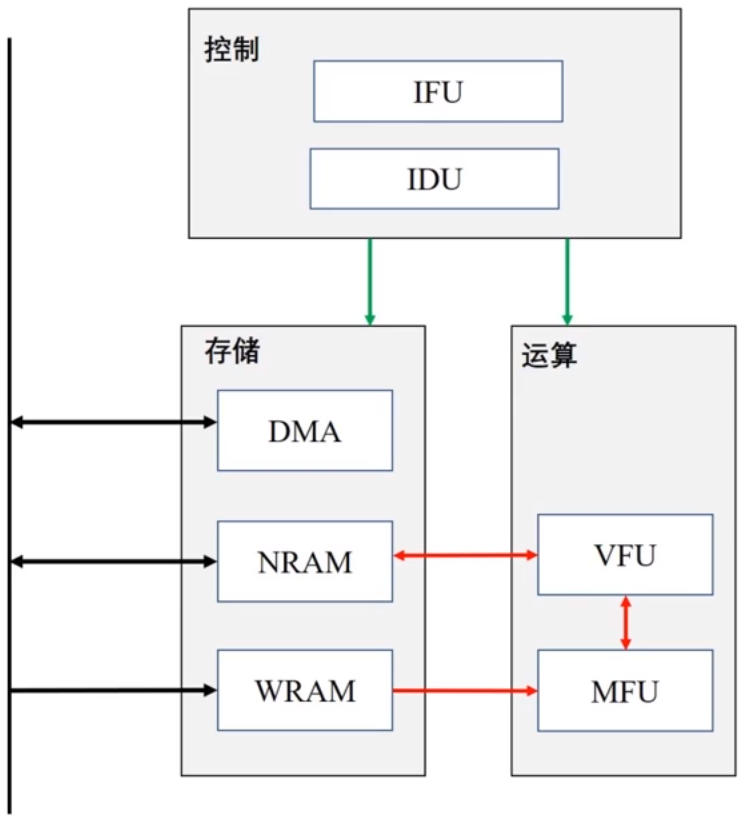

# Chapter 7 深度学习处理器架构
Revision: 1

## 7.1 单核深度学习处理器(DLP-S)

从DLP到DLP-S：
- 控制模块
	- 多发射队列，支持指令级并行；
- 运算模块
	- 增加运算器中的操作，支持硬件高效执行的操作；
	- 低位宽运算器，提高执行能效；
	- *稀疏运算，提高计算效率*；
- 存储单元
	- 稀疏数据的稠密化访存，降低开销；
	- 转换检测缓冲区(TLB, Translation Lookaside Buffer)，降低访存延迟；
	- 最后一级cache(LLC, Last Level Cache)，降低访存延迟；

### 执行流程

1. IFU通过DMA从DRAM中读取程序指令，经IDU进行译码后分发给DMA、VFU和MFU；
2. DMA接收到指令后从DRAM读取神经元至NRAM，读取权重至WRAM；
3. VFU接收到指令后从NRAM中读取神经元数据，并进行预处理，然后发送至MFU；
4. MFU接收到指令后从VFU接收仅预处理后的神经元数据，并从WRAM中读取权重数据，完成矩阵运算后将结果发给VFU；
5. VFU对输出神经元进行后处理（如激活、池化）；
6. VFU将运算结果写回NRAM；
7. DMA将输出神经元从NRAM写回到DRAM；

- 神经元数据流：DRAM→NRAM→VFU→(MFU→VFU→)NRAM→DRAM；
- 权重数据流：DRAM→WRAM→MFU；

### 控制模块

- IFU
	- 地址生成器AGU(Address Generator Unit)；
	- 指令高速缓存ICache(Instruction Cache)；
	- 指令回填单元RB(Refill Buffer)；
	- 指令队列IQ(Instrcution Queue)；
- IDU
	- 译码单元
	- 指令发射队列
	- 算数逻辑单元ALU

### 运算模块VFU

- 完成输入神经元的前处理和输出神经元的后处理；
- 包括向量流水单元和转置单元；
	- 多种数据类型：INT8/16/32、FP16/32；
	- 新增运算：查表、边缘扩充、数据格式转换等；
	- 多个stage可以输入，多个stage可以输出；
- 向量流水单元承载向量运算功能；
- 转置单元承载数据重新摆放功能；

### 运算模块

- MFU：矩阵运算单元
	- H-tree互联；
	- 低位宽定点运算器；
	- 三种模式：
		- INT16*INT16；
		-  INT8*INT8；
		- INT8*INT4；

### 存储单元

- 存储管理
	- NRAM、WRAM、DMA；
	- 虚拟存储：片内片外统一编址；
	- 片内无需虚实地址转换；
	- 片内外需虚实地址转换；
- 降低访存延迟
	- TLB：缓存常用页表；
	- LLC：缓存经常访问的DRAM数据；

## 多核深度学习处理器(DLP-M)

#### 总体架构

- 多核处理器分层结构设计
	- 一个DLP-M由多个DLP-C构成；
	- 一个DLP-C由多个DLP-S构成；
- DLP-C
	- 四个DLP-S
	- 存储核Memory Core
		- 存储：DLP-S共享数据；
		- 通信：DLP-C与片外DRAM，DLP-C之间，多个DLP-S之间；

#### Cluster架构
略

#### 互联架构

核间互联拓扑结构

- 不同核到同一个核的延时相同：提供所有核完全对等的编程模型；
- 核间的互联通路尽量稠密：减少单个通路负载，同时降低访问延时；
