# Chapter 7 深度学习处理器架构
Revision: 1

## 7.1 单核深度学习处理器(DLP-S)

从DLP到DLP-S：
- 控制模块
	- 多发射队列，支持指令级并行；
- 运算模块
	- 增加运算器中的操作，支持硬件高效执行的操作；
	- 低位宽运算器，提高执行能效；
	- *稀疏运算，提高计算效率*；
- 存储单元
	- 稀疏数据的稠密化访存，降低开销；
	- 转换检测缓冲区(TLB, Translation Lookaside Buffer)，降低访存延迟；
	- 最后一级cache(LLC, Last Level Cache)，降低访存延迟；

### 执行流程
| 步骤 | 描述 | 
| :--: | :---------: | 
| 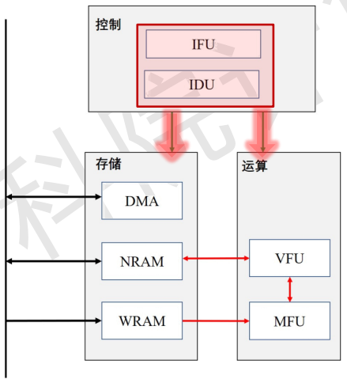 |   IFU通过DMA从DRAM中读取程序指令，经IDU进行译码后分发给DMA、VFU和MFU   |
| 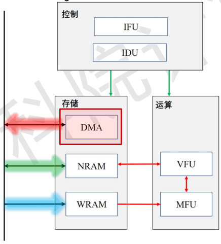 | DMA接收到指令后从DRAM读取神经元至NRAM，读取权重至WRAM |
| 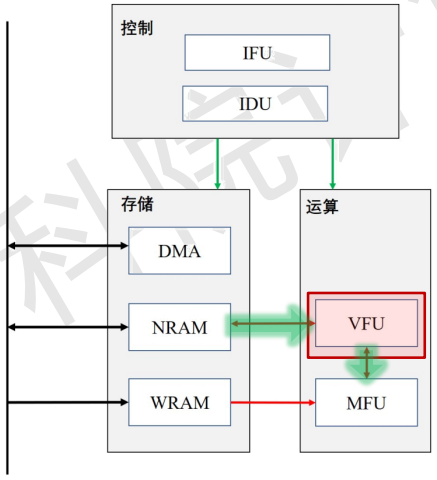 | VFU接收到指令后从NRAM中读取神经元数据，并进行预处理，然后发送至MFU |
| 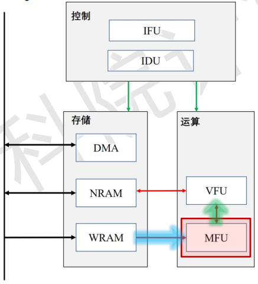 | MFU接收到指令后从VFU接收仅预处理后的神经元数据，并从WRAM中读取权重数据，完成矩阵运算后将结果发给VFU |
| 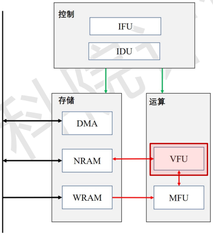 | VFU对输出神经元进行后处理（如激活、池化） |
| 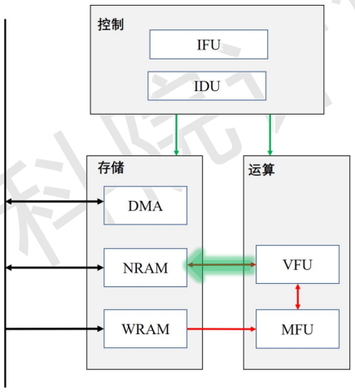 | VFU将运算结果写回NRAM |
| 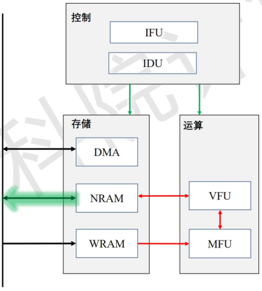 | DMA将输出神经元从NRAM写回到DRAM |

- 神经元数据流：DRAM→NRAM→VFU→(MFU→VFU→)NRAM→DRAM；
- 权重数据流：DRAM→WRAM→MFU；

### 控制模块
- IFU
	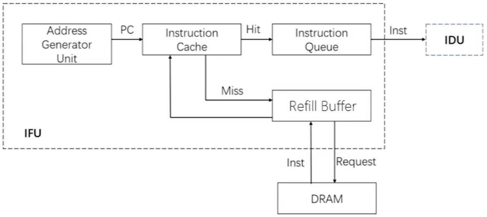
	- 地址生成器AGU(Address Generator Unit)：
		1. PC=0
		2. PC=PC+1
		3. PC=Jump/CB Reg
	- 指令高速缓存ICache(Instruction Cache)；
	- 指令回填单元RB(Refill Buffer)；
	- 指令队列IQ(Instrcution Queue)；
- IDU
	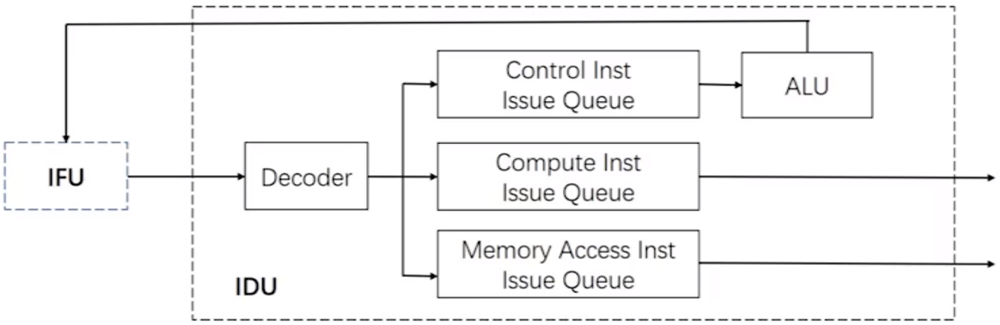
	- 译码单元Decoder
	- 指令发射队列(Issue Queue)：
		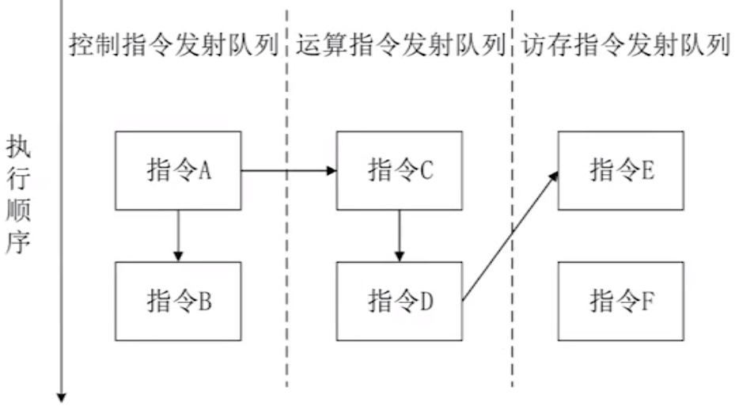
		- Control IQ、Compute IQ、Memory Access IQ
		- 三个指令队列乱序发射，指令队列内顺序发射；
		- 两条同类型指令有依赖：位于同一发射队列顺序发射；
		- 两条不同类型指令有依赖：添加SYNC同步指令；
	- 算数逻辑单元ALU

### 运算模块VFU
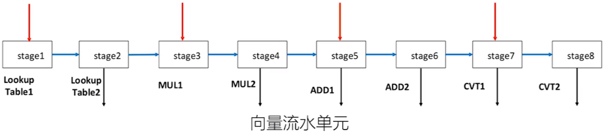
- 完成输入神经元的前处理和输出神经元的后处理；
- 包括向量流水单元和转置单元；
	- 多种数据类型：INT8/16/32、FP16/32；
	- 新增运算：查表、边缘扩充、数据格式转换等；
	- 多个stage可以输入，多个stage可以输出；
- 向量流水单元承载向量运算功能；
- 转置单元承载数据重新摆放功能；

#### 向量流水单元如何完成Avg Pooling
- 当输入数据类型是INT时：
	- Avg Pooling本质是$k_x\times k_y$个向量的累加（$k_x$和$k_y$是Pooling核大小）；
	- INT型的加法延迟是1个cycle；
	- 使用stage5即可完成INT数据类型的Avg Pooling；
	- 每个步骤是一个cycle，所以完成Avg Pooling需要$k_x\times k_y$个cycles；
	- 步骤：
| 步骤 | 描述 |
| :--: | :----------: |
| 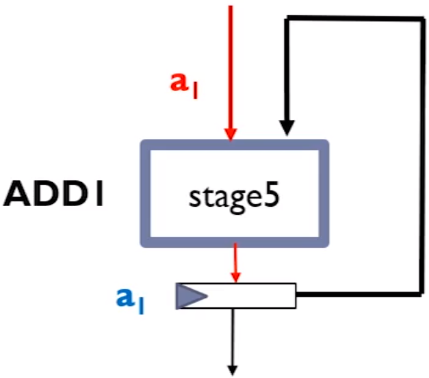 | 输入向量1 BYPASS stage5后进入stage5输出寄存器 |
| | 输入向量2与输入向量1经过stage5的定点加法器，完成加法运算后，写入stage5输出寄存器 |
| 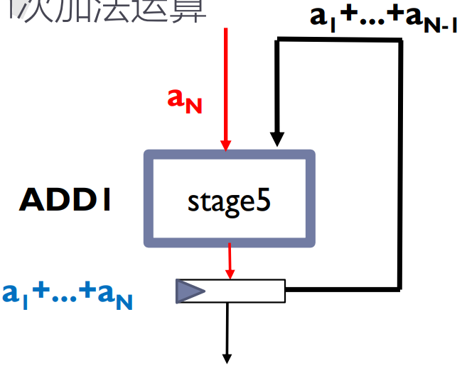 | 重复步骤2直至完成$k_x\times k_y-1$次加法运算 |
| 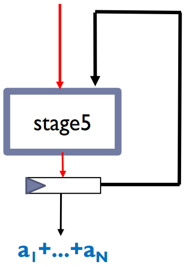 | 将结果从stage5的输出寄存器输出 |

- 当输入数据类型是Float型时
	- Float型的加法延迟是2 cycles；
	- 使用stage5和stage6即可完成Float数据类型的Avg Pooling；
	- 步骤：
		1. 输入向量1 BYPASS stage5和stage6后进入stage6输出寄存器；
		2. 输入向量2与输入向量1经过stage5和stage6的浮点加法器，完成加法运算后，写入stage6输出寄存器；
		3. 重复步骤2直至完成$k_x\times k_y-1$次加法运算；
		4. 将结果从stage6的输出寄存器输出；
	- 每个步骤是2 cycles，所以完成Avg Pooling需要$2\times k_x\times k_y$个cycles；

#### 向量流水单元完成神经元压缩
- 神经元经过ReLU会产生很多0；
- 如何将这些0进行过滤，生成稠密的神经元？
- 从而减少数据搬运，减少能耗；
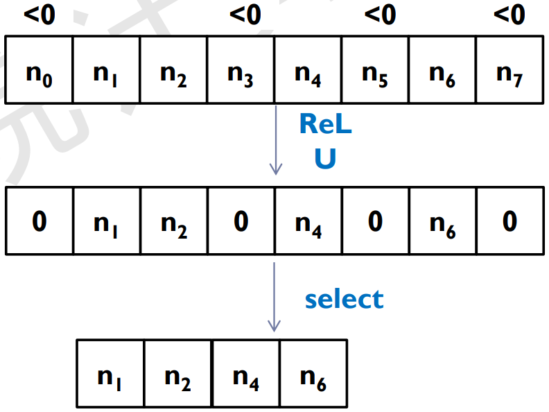

### 转置单元
- 支持多种数据类型，INT8/16/32、FP16/32；
- 功能包括转置、镜像、旋转等；
- 主要由一个数据缓存和读写控制逻辑组成；
- 读写控制逻辑能够对数据缓存进行多种模式的读写；
- 实现操作
| 操作 | 描述 | 步骤 |
| :--: | :---------: |:---------: |
| 转置 |  | 1. 从第一行开始，将数据从左向右写入缓存，直至填满数据缓存；2. 从第一列开始，将数据从上到下依次读出，直至读完缓存中的所有数据； |
| 镜像 | 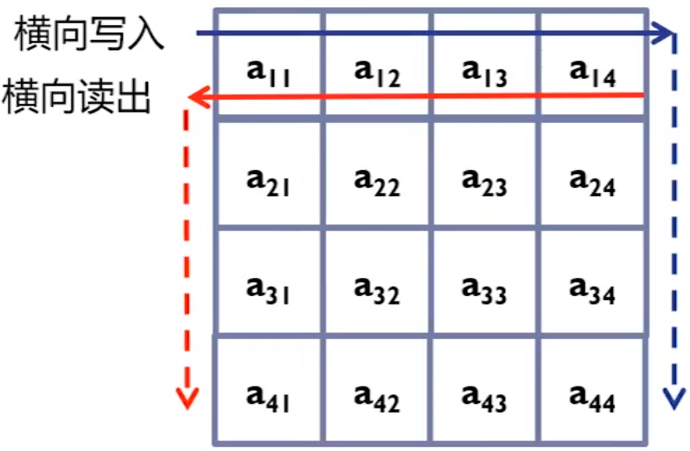 | 1. 从第一行开始，将数据从左向右写入缓存；2. 从第一列开始，将数据从右向左依次读出；|
| 旋转180度  | 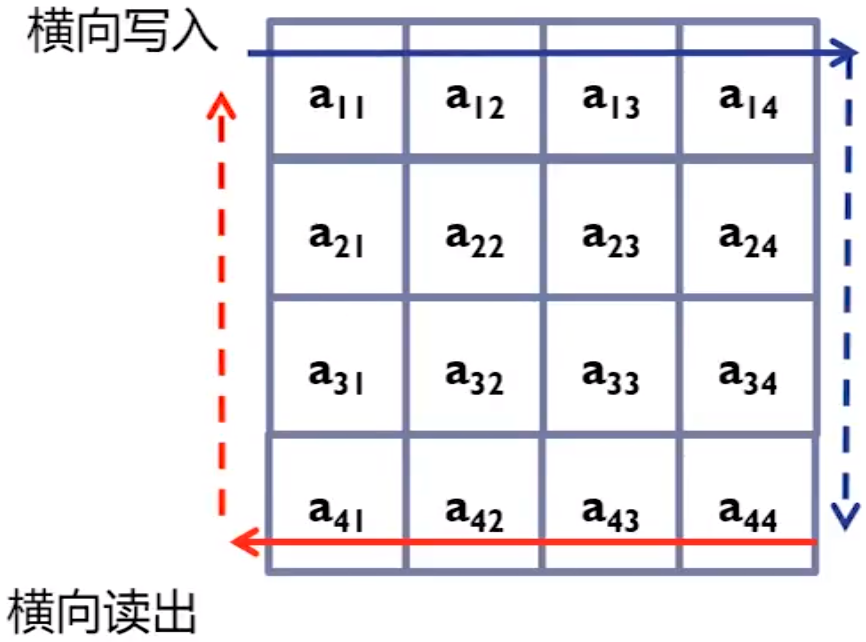 | 1. 从第一行开始，将数据从左向右写入缓存；2. 从最后一行开始，将数据从右向左依次读出 |
| 顺时针旋转90度 | 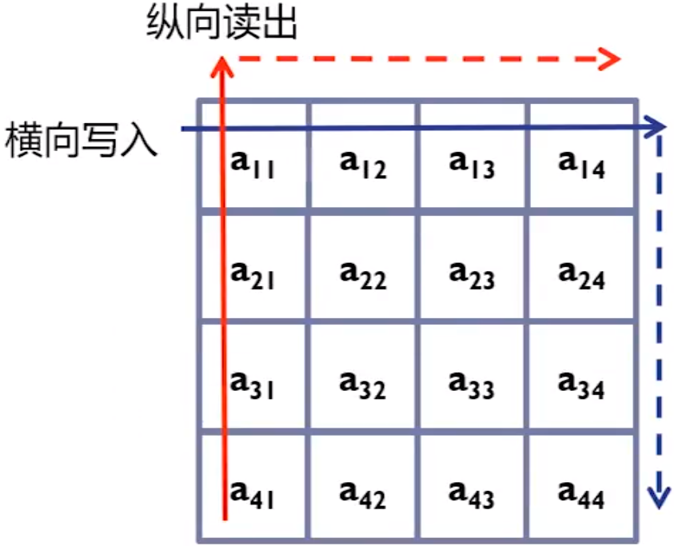 | 1. 从第一行开始，将数据从左向右写入缓存；2. 从第一列开始，将数据从下到上依次读出 |
| 顺时针旋转270度 | 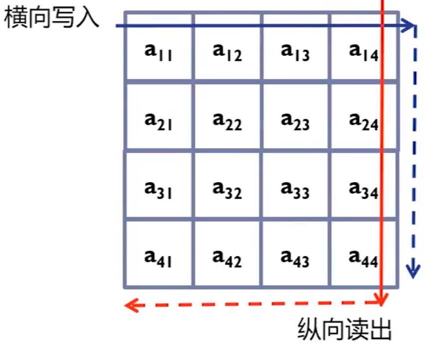 | 1. 从第一行开始，将数据从左向右写入缓存；2. 从最后一列开始，将数据从上到下依次读出 |

### 运算模块
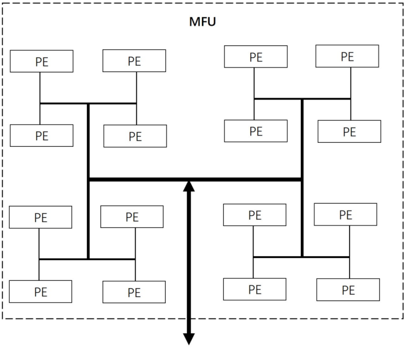
- MFU：矩阵运算单元
	- H-tree互联；
	- 低位宽定点运算器；
	- 三种模式：
		- INT16×INT16；
		- INT8×INT8；
		- INT8×INT4；

### 存储单元

- 存储管理
	- NRAM、WRAM、DMA；
	- 虚拟存储：片内片外统一编址；
	- 片内无需虚实地址转换；
	- 片内外需虚实地址转换；
- 降低访存延迟
	- TLB：缓存常用页表；
	- LLC：缓存经常访问的DRAM数据；

## 多核深度学习处理器(DLP-M)

#### 总体架构

- 多核处理器分层结构设计
	- 一个DLP-M由多个DLP-C构成；
	- 一个DLP-C由多个DLP-S构成；
- DLP-C
	- 四个DLP-S
	- 存储核Memory Core
		- 存储：DLP-S共享数据；
		- 通信：DLP-C与片外DRAM，DLP-C之间，多个DLP-S之间；

#### Cluster架构
略

#### 互联架构

核间互联拓扑结构

- 不同核到同一个核的延时相同：提供所有核完全对等的编程模型；
- 核间的互联通路尽量稠密：减少单个通路负载，同时降低访问延时；
