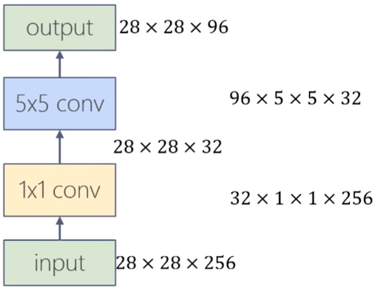

# Chapter 3 深度学习
*让机器更好地理解和服务人类*
- 图像信息
	- 任务：理解图像内容
	- 方法：卷积神经网络
- 序列信息
	- 任务：立即语音/文字/视频
	- 方法：循环神经网络

## 3.1 CNN
|          |               全连接                |                     卷积                     |
| :------: | :---------------------------------: | :------------------------------------------: |
| 局部连接 |                                 |                                          |
| 权重共享 |  所有神经元之间的连接使用不同权重   | 输出层神经元**共用一组权重**，进一步减少权重数量 |
| 权重数量 | $w_i\times h_i\times w_o\times h_o$ |                 $f\times f$                  |

## 3.2 层
### 卷积层
重要特征：**局部连接**、**参数共享**；可有效减少权重参数，避免过拟合，为增加卷积层提供可能。

#### 如何检测特征？
- 检测复杂边缘：将权重作为参数，在训练中学习；
- 卷积运算，实际为计算**矩阵内积**（相关系数）：$y(n)=\sum^\infty_{i=-\infty}x(i)h(n-i)=x(n)*h(n)$
- 多输入特征图单输出特征图卷积运算：input(6x6x3) * filter(3x3x3) = output(4x4)

- 多输入特征图多输出特征图卷积运算：input(6×6x3) * (filter1 & filter2)(2x3x3x3) = output(4x4×2)，不同的过滤器可检测不同特征。

#### 边界扩充(padding)
- 扩大输入图像/特征图的尺寸并填充像素；
- 防止深度网络中图像被动持续减小；
- 强化图像边缘信息；

#### 卷积步长(stride)
- 滑动滤波器时每次移动的像素点个数；
- 与padding共同确定输出图像尺寸；

$input=w_i\times h_i$，$filter=f\times f$，$pad=p$，$stride=s$
$output=\lfloor\dfrac{w_i+2p-f}{s}+1\rfloor\times\lfloor\dfrac{h_i+2p-f}{s}+1\rfloor$

#### 卷积层参数

| 卷积层 | 输入层 | 过滤器权重 | 偏置 | 输出 |
| :------: | :-----: | :-------: | :-----: | :-----: |
| 参数 | $w_i\times h_i\times c_i$ | $c_0\times f\times f\times c_i$ | $1\times 1\times c_0$ | $w_0\times h_0\times c_o$ |

### 池化层(pooling)
- Max/Avg/L2 pooling；
- 主动减小图片内尺寸，减少参数和计算量，控制过拟合；
- 不引入额外参数；
- 保留特征最大值，提高提取特征鲁棒性；

### 全连接层
- 分类器；
- 将特征提取得到高位特征图映射成一维特征向量，该特征向量包含所有特征信息，可转化为各个类别的概率；

### Softmax
- 网络最后一层，输出归一化，输出分类概率；
- 凸显最大值并抑制远低于最大值的其他分量；
- Softmax输入、输出数据规模相同；
- $f(z_j)=e^{z_j}/\sum^n_{i=0}e^{z_i}$

### 卷积神经网络结构
#### 层排列规律
- 常见组成：conv+pooling+fc；
- 各层常见排列如下图所示，$N$、$M$、$K$为重复次数：

- 其中，卷积和池化部分可包含分支、连接结构；
- 浅层学习**局部特征**，深层学习**整体特征**；

#### 为何选择深而非广的网络结构
- 深度网络可从局部到整体“理解图像”：浅层卷积层感受野小，学习局部特征；深层感受野大，学习到整体特征；
- 深度网络可减少权重数量：以宽度换深度，用小卷积代替大卷积，在获得更多特征的同时所需权重数量更少；

## 3.3 基于CNN的图像分类算法
### AlexNet
*两台GPU并行训练*

成功原因：
1. 使用多个卷积层，有效提取图像特征；
2. ReLU激活函数：收敛速度更快，帮助提高训练速度；
3. 局部归一化(LRN)：提升较大响应，抑制较小响应（其实无明显效果）；
4. Maxpooling：避免特征被平均池化模糊，提升特征鲁棒性；
5. Dropout、数据增强扩大训练集， 防止过拟合；

### VGG16
*由简单到复杂的网络结构*

实验结果：
1. A/A-LRN：加LRN准确率无明显提升；
2. A/B/D/E：层数越多准确率越高；
3. C/D：conv3×3比conv1×1得到的准确率高；
4. Multi-scale training可明显提高准确率；

规整的**卷积-池化**结构：
- 多层小卷积比单层大卷积效果好；
- 一个5×5 conv和两个3×3 conv的感受野相同；每个卷积层加入ReLU，两层3×3 conv决策函数的区分能力更强；
- 相同感受野，多层网络权值更少，例如：7×7 conv，$W_{num}=7\times 7=49$；而3×3 conv×3，$W_{num}=3\times 3\times 3=27$；

成功原因：
1. 更深的CNN，更多的conv和非线性激活函数，提升分类准确率；
2. 使用**规则的多层小卷积替代大卷积**，减少参数数量，提高训练收敛速度；
3. 部分网络层参数的**预初始化**，提高训练收敛速度；

### GoogLeNet(Inception-v1)

#### Inception模块
- Naive version：叠加多种尺寸的卷积层和池化层，获得不同尺度的特征，提高网络对不同尺寸特征的适应性；
- Dimension redutions：使用1×1卷积层来缩减维度（减少channel），形成“瓶颈层”，减少参数；

1x1卷积：

-  作用：跨通道聚合，进一步起到降维（或升维）作用，减少参数：
| 不同结构 |  |  |
| :------: | :-----: | :-------: |
| 乘法次数 | 28×28×96×5×5×256≈4.8×10^8 | 28×28×32×256+28×28×96×5×5×32≈6.7×10^7 |
| 参数数量 | 96×5×5×256≈6.1×10^5 | 32×256+96×5×5×32≈8.5×10^4 |
- 相当于在输入与输出之间做一个特征上的**全连接**，提取到非线性特征；
- 同时，当$c_o<c_i$时，维度降低，参数减少；

#### Softmax辅助分类网络

- 训练时，让中间某一层的输出经过softmax得到分类结果，并按较小的权重加到最终分类结果中，相当于**模型融合**。防止多层神经网络训练过程中梯度消失；
- 推理时，去掉softmax辅助分类网络；

### BN-Inception

- 学习VGG，用两个3×3卷积代替一个5×5卷积；
- 使用**Batch Norm**，并在每个卷积层之后、激活函数之前插入BN层；

Batch Normalization
- Normalize
	- 将激活层的输入调整至标准正态分布（均值0，方差1）；
	- 激活层输入分布在激活函数敏感部分，输入有小变化就能使损失函数有较大反应，避免梯度消失，加快训练速度；
- Scale & shift
	- 标准化后的输入使得网络表达能力下降；
	- 为保持网络的表达能力，增加两个可训练参数；
- 效果：
	- 可替代LRN/Dropout/L^2^ Normalization
	- 可提高收敛速度，训练速度；
	- 可选择更高的学习率，方便调参；

### Inception-v3
- Factorization思想
	- 将3×3卷积拆分成1×3和3×1卷积；
	- 减少参数数量，同时通过非对称的卷积结构拆分增加特征多样性；

- 网络结构
	- 将前面三种Inception结构组合；
	- GoogLeNet中7×7卷积拆分成3×3卷积；
	- 卷积层和辅助分类器的全连接层做BN；

### ResNet

- 问题：卷积层堆积就能提升图像分类准确率吗？
- 实验：分别用20层和56层CNN在cifar10数据集上进行训练和测试，发现更深的网络错误率更高，在ImageNet数据集上也是如此。
- 原因
	- 梯度消失？No，使用BN能有效缓解梯度消失；
	- 过拟合？No，更深的网络在训练集上的误差同样更高；
	- **神经网络退化**：收敛到极值点而非最值，误差大；

#### 残差块
- 普通网络：直接用多项式拟合输出；
- 残差网络：建立在BN之上，用多项式拟合插值；
- 优点：在解附近时权重的反应更灵敏，更易学习获得最优解，更易收敛；
- 求偏导，例如$\partial H(x)/\partial F(x)$，至少会有1为基础；

- 将残差块应用至普通网络
	- 改造VGG得到plain-network（无跳转的普通网络）；
	- 增加跳转连接得到ResNet；

## 3.4 基于CNN的图像检测算法
|      |         分类         |      定位+分类       |          物体检测          |
| :--: | :------------------: | :------------------: | :------------------------: |
| 输入 | single & big object  | single & big object  |    multi & small object    |
| 输出 |        label         | label & bounding box | multi label & bounding box |
| 评价 | precision(top1/top5) |    IoU（交并比）     |            mAP(Mean Average Precision)             |
1. 两阶段(two-stage)算法：基于候选区域方法，先产生边界框，再做CNN分类（R-CNN系列）
2. 一阶段(one-stage)算法：对输入图像**直接处理**，同时输出定位及其类别（YOLO系列）

### 评测指标
#### IoU
用于衡量定位准确度，一般$IoU\ge0.5$可认为定位成功(true detection)。

$IOU=\dfrac{A\cap B}{A\cup B}$

#### mAP
- 定义：衡量模型在测试集上检测精度的优劣程度，综合考虑召回率/查全率和精度/查准率，mAP值越高越好；
- 计算原理：
	- 召回率/查全率(recall)：选的$N$个样本里对的$k$个正样本占总的$M$个正样本的比例$k/M$（选出了多少个对的？）；
	- 精度/查准率(precision)：选的$N$个样本里选对的$k$个正样本比例$k/N$（做出判断的里面真正对了几个？）；
	- 选择的样本数$N$越多，召回率越高，查准率越低；
	- **置信度**阈值越小，选中样本越多，精度越低，召回率越高；

- 召回率：$k/M=TP/(TP+FN)$
- 精度：$k/N=TP/(TP+FP)$
- 类A的AP值计算方法：对**每个召回率**，取最大的精度，再求平均：

### R-CNN
#### 主要步骤
1. 候选区域提取：使用选择性搜索从输入图片提取出2000个左右候选区域；
2. 特征提取：首先将所有候选区域裁切缩放，再用AlexNet提取图像特征；
3. 线性分类：用特定类别的线性SVMs对每个候选区域分类；
4. 边界框回归：用线性回归修正边界框位置与大小，每个类别单独训练一个边界框回归器；

#### 候选区域(Region Proposal)
- 意义：不用经典的目标检测算法滑动窗法判断区域（穷举），用Region Proposal预先提取出一系列较可能是物体的候选区域，之后浸在这些候选区域上提取特征，减少计算量；
- 方法：带多样性策略的**选择性搜索**；
- 候选区域提取：层次化分组算法，略；

#### 分类与回归
1. SVM分类
2. 非极大值抑制
3. Bounding Box回归

#### 缺点
- 重复计算：对2000个候选框做CNN，计算量大，重复计算；
- SVM模型：在标注数据足够时，不是最佳选择；
- 多个步骤：候选区域提取、特征提取、分类、回归均要单独训练，大量中间数据需要保存；
- 检测速度慢：GPU上处理一张图片需要13秒，CPU需要53秒；

### Fast R-CNN
#### 主要步骤
1. 候选区域提取：同R-CNN；
2. 特征提取：**原始图像**输入CNN网络，得到特征图；
3. **ROI-Pooling**：根据映射关系，将不同尺寸的候选框在特征图上的对应区域池化为维度相同的特征图：
	- 目的：将不同尺寸的ROI对应的卷积特征图转化为固定大小。复用卷积层提取的特征图，提高图像处理速度；为全连接层提供固定尺寸的特征图；
	- 特点：输出尺寸与输入尺寸无关。对特征图的每个通道，根据输出尺寸$H\times W$，将输入$h\times w$均分成多块$h/H\times w/W$的小块，取每块最大值作为输出；
4. 全连接层：将上述特征图转化为ROI特征向量；
5. 分类与回归：经过FC层，再用Softmax分类器做识别，用回归器修正边界框的位置与大小，最后对每个类别做NMS；

#### 改进之处
- 直接对整张图像做卷积，不再对每个候选区域分别做卷积，减少重复计算；
- 用ROI Pooling对不同候选框的特征进行尺寸归一化；
- 将边界框回归器放进NN一起训练，每个类别对应一个回归器；
- 用Softmax代替SVM分类器；

#### 缺点
- 候选区域提取仍使用选择性搜索，目标检测时间大多消耗在此；

### Faster R-CNN
*Faster R-CNN = 候选区域生成网络RPN + Fast R-CNN*

#### RPN
- 目的：
	1. 输入特征图，输出候选区域集合，包括各候选区域属于前景/背景的概率，以及位置坐标；
	2. 采用**Anchor机制**能直接从特征图上提取候选区域特征，减少运算量；
	3. 融合在一个NN中，方便训练测试；
- 步骤及方法：
	1. 先经过一个3x3卷积，使每个点对应256/512维特征向量；
	2. 分两路处理：
		- 判断候选框是前景/背景；
		- 用bbox regression确定候选框位置；
	3. 计算得到前景候选框，再用NMS去除冗余候选框，最终输出候选区域；
- 关于Anchor box
	- 对于特征图的每个位置，考虑9个可能的候选框：三种面积分别为128×128、256×256、512×512，每种面积又分为三种长宽比：2:1、1:2、1:1，这些候选框被成为anchors；
	- 在RPN中，特征图每个位置输出$2k$个得分，分别表示该位置$k$个anchor为前景/背景的概率；同时每个位置输出$4k$个框位置参数用$[x,y,w,h]$表示；

### YOLO

#### 统一检测(Unified Detection)
1. 将输入图像分为$S\times S$个格子，每个格子预测$B$个Bounding box，每个bbox包含五个预测值：$x,y,w,h$与confidence；
2. $x,y,w,h$用于表示bbox位置和大小，且被归一化至$(0,1)$；
3. confidence综合考虑当前bbox内存在目标的可能性$Pr(Object)$，以及预测目标位置的准确性$IOU(pred|truth)$；
4. 每个格子还要预测分别属于$C$种类别的条件概率$Pr(Class_i|Object),i=0,1,\cdots,C$，其中$C$为数据集类别数；在测试时，属于该格子的$B$个bbox共享这$C$个类别的条件概率，则某个bbox的类别置信度为：

$Pr(Class_i|Object)*Pr(Object)*IOU(pred|truth)=Pr(Class_i)*IOU(pred|truth)$

5. 最终输出tensor的维度为：$S\times S\times(B\times 5+C)$；

#### 优点
*v1*
1. 检测速度快。YOLO将目标检测重建为**单一回归问题**，对输入图像直接处理，同时输出边界框坐标和分类概率，且每张图像仅预测98个bbox；
2. 背景误判少。以往基于滑窗或候选区域提取的目标检测算法，只能看到图像的局部信息，绘出先把背景当前景的问题。而YOLO在回归之前做了全连接，在训练和测试时每个cell都会使用**全局信息做预测**；
3. 泛化性更好。YOLO能学习到目标的泛化表示，能迁移到其他领域；

#### 缺点
1. 邻近物体检测精度低。YOLO对每个cell仅预测两个bbox与一个分类，若多个物体中心都在统一cell内，检测精度低；
2. 损失函数设计过于简单。用坐标和分类的MSE作为损失函数不合理；
3. 训练不易收敛。直接预测的bbox位置，相较于预测物体的偏移量，模型收敛不稳定；

#### 拓展*
- YOLO-v2：提高了训练图像的分辨率，引入Faster R-CNN中的Anchor Box思想……
- YOLO-v3：类似FPN的多尺度预测，更好的基础分类网络，Sigmoid代替Softmax用于多标签分类……

### SSD
主要思想：基于YOLO直接回归bbox和分类概率的one-stage检测方法，结合Faster R-CNN中的Anchor Box思想产生先验框，并采用**特征金字塔**进行**多尺度预测**，在满足检测速度快的同时，提高检测准确度：

## 3.5 序列模型
任务特点：按时序输入的数据之间不是相互独立的，前后数据之间有**相关性**，所以网络要有“存储”信息的能力。

### RNN
- 通过使用带自反馈神经元，能处理任意长度的序列；
- 时刻$t$的输入为$\boldsymbol{x}^{(t)}$，隐藏状态为$\boldsymbol{h}^{(t)}$。$\boldsymbol{h}^{(t)}$既和当前时刻输入$\boldsymbol{x}^{(t)}$相关，也和上一时刻隐藏状态$\boldsymbol{h}^{(t-1)}$相关：
- $\boldsymbol{h}^{(t)}=f(W\boldsymbol{h}^{(t-1)}+U\boldsymbol{x}^{(t)}+\boldsymbol{b})$
- 其正向传播、反向传播(BPTT, back propagation through time)的计算与CNN类似；

#### 特点
- 时序(sequence)：RNN能建模序列数据，序列指的是前、后输入数据不独立，相互影响；
- 循环(recurrent)：循环地重复相同操作，每时刻有相同参数$W$和$U$（参数共享）；
- 记忆(memory)：隐藏层$\boldsymbol{h}^{(t)}$中捕捉了所有时刻$t$之前的信息，理论上$\boldsymbol{h}^{(t)}$记忆内容可以无限长；

#### 多种输入-输出结构

#### 梯度消失与梯度爆炸
由于梯度爆炸或消失的存在，RNN实际上只能学习到**短期的依赖关系**；

改进：
- 梯度爆炸：梯度截断；
- 梯度消失：模型改进，LSTM、GRU算法；

### LSTM
*长短期记忆模型，人的大脑也是*

- 遗忘门：记住前一时刻单元状态的多少内容；
- 输入门：写入多少输入到当前单元；
- 输出门：输出多少当前单元状态；

#### 变体
- 窥视孔连接：门值不仅取决于$h_{t-1}$和$x_t$，也取决于上一个单元状态值$C_{t-1}$；
- 耦合输入门和遗忘门：不单独决定遗忘和新增信息，在输入时一起做决定；

### GRU
在LSTM基础上，将单元状态和隐藏状态合并，将遗忘门和输入门合并为更新门，无输出门。更新门决定历史信息和当前信息如何相加，重置门决定保留多少历史信息进入当前信息。

与LSTM的好坏无定论。GRU参数量更少，训练速度快；在训练数据足够的情况下，LSTM表征能力更强。

### GAN
解决的问题：从训练样本中学习出新样本。为无监督、预测学习提供算法框架。

#### 无监督学习
- 有监督学习：损失函数给定，网络学习到的是**数据的模式/特征**；
- 无监督学习：损失函数学习得到，网络学习到的是**数据的分布**；

#### 模型组成
- 生成器（伪装者）：找出观测数据内部的统计规律，尽可能生成以假乱真的样本，使判别网络输出接近0.5；
- 判别器（警察）：判断输入数据时来自真实样本集还是生成样本集；

#### 训练过程

- 更新判别网络权值参数，使其能分清真假样本；
- 更新生成网络权值参数，使其生成的加样本被判别网络识别为真样本；
- 优化判别器$D$
	- $\boldsymbol{J}^{(D)}=-E_{x\sim P_{data}(x)}[\log(D(\boldsymbol{x}))]-E_{z\sim p_z(z)}[\log(1-D(G(z)))]$
	- 优化目标：输入真样本$x$时，输出接近1；输入生成样本$G(z)$时，输出接近0；
- 优化生成器$G$
	- $J^{(G)}=E_{z\sim p_z(z)}[\log(1-D(G(z)))]$
	- 优化目标：生成的假样本$G(z)$，被判别器判断为接近1，即$1-D(G(z))$越小越好；
- GAN训练是极小极大博弈问题（或零和博弈）；
$\min\limits_G\max\limits_D V(D,G)=-J^{(D)}=E_{x\sim P_{data}(x)}[\log(D(\boldsymbol{x}))]+E_{z\sim p_z(z)}[\log(1-D(G(z)))]$
- GAN有一个整体的损失函数，而不需要分别指定具体的损失函数，有较强通用性；

#### 问题
- 梯度消失：当判别其以高置信度成功判断生成器生成的样本为假样本时，生成器的梯度会消失。训练早期，$\log(1-D(G(z)))$会饱和；
	- 应对方法：修改生成器的代价函数：$J^{(G)}=-E_{z\sim p_z(z)}[\log(D(G(z)))]$
- 模式崩溃： 生成器之生成几种模式的样本，缺乏多样性；
	- 产生原因：GAN的损失函数使判别器假样本的惩罚是巨大的，一旦生成的某一类假样本成功骗过判别器，生成器就趋向于生成相似的样本；
	- 应对方法(WGAN)：采用更平滑的损失函数；*对失败宽容一些‘*

#### GAN结构
- 卷积GAN
- 条件GAN
- 集成推理模型的GAN
- 对抗自编码器

#### GAN应用
- 人脸生成
- 风格转换
- 超分辨率

## 3.6 Driving Example
### Image Style Transfer

1. 给定一张风格图像$a$和一张内容图像$p$；
2. 风格图像经CNN生成的特征图组成风格特征集$A$；内容图像$p$通过CNN生成的特征图组成内容特征集$P$；
3. 输入一张随机噪声图像$x$，随机噪声图像$x$通过CNN生成的特征图构成内容特征和风格特征集合$F$和$G$，目标损失函数由$A$、$P$、$F$、$G$算得；
4. 优化函数：调整图像$x$，使其最后看起来既保持内容图像$p$的内容，又有风格图像$a$的风格；

- 内容损失函数：计算内容图片特征和噪声图片特征之间的**欧氏距离**：
	- $L_{content}(\boldsymbol{p},\boldsymbol{x},l)=\dfrac{1}{2}\displaystyle\sum_{i,j}(F_{ij}^l-P_{ij}^l)^2$
		- $l$：用于计算内容特征的层数；
		- $F_{ij}^l$：生成图片在第$l$层第$i$个特征图上位置$j$处的特征值；
		- $P_{ij}^l$：生成图片在第$l$层第$i$个特征图上位置$j$处的特征值；
		- $p$：内容图片；
		- $x$：生成图片；
- 风格损失函数：使用**相关矩阵**来表示图像的风格；
	- $L_{style}(\boldsymbol{a},\boldsymbol{x})=\displaystyle\sum_l w_l E_l$
	- $E_l=\dfrac{1}{4N_l^2 M_l^2}\displaystyle\sum_{i,j}(G_{ij}^l-A_{i,j}^l)^2$
	- $G_{ij}^l=\displaystyle\sum_k F_{ik}^l F_{jk}^l$
	- $G_{ij}^l=\displaystyle\sum_k F_{ik}^l F_{jk}^l$
		- $l$：用于计算风格特征的层数；
		- $w_l$：第$l$层的$E_l$用于计算风格损失的权重，取0.2；
		- $a$：初始风格图片；
		- $x$：生成图片；
		- $A_{ij}^l$：风格图片在第$l$层第$i$个特征图和第$j$个特征图的内积；
		- $G_{ij}^l$：生成图片在第$l$层第$i$个特征图和第$j$个特征图的内积；
		- $M_l$：第$l$层的输出特征图的大小；
		- $N_l$：第$l$层的输出特征图的数目；
		- $F_{ik}^l$：第$l$层第$i$个特征图上位置$k$处的特征值；
- 损失函数：
$L_{total}(\boldsymbol{p},\boldsymbol{a},\boldsymbol{x})=\alpha L_{content}(\boldsymbol{p}, \boldsymbol{x})+\beta L_{style}(\boldsymbol{a},\boldsymbol{x})$

- $\alpha/\beta$越大，内容越具象

#### Real-Time Image Style Transfer
略