# Chapter 2 神经网络基础
Revision：4

## 2.1 从机器学习到神经网络I
### 包含关系
人工智能→机器学习→神经网络→深度学习

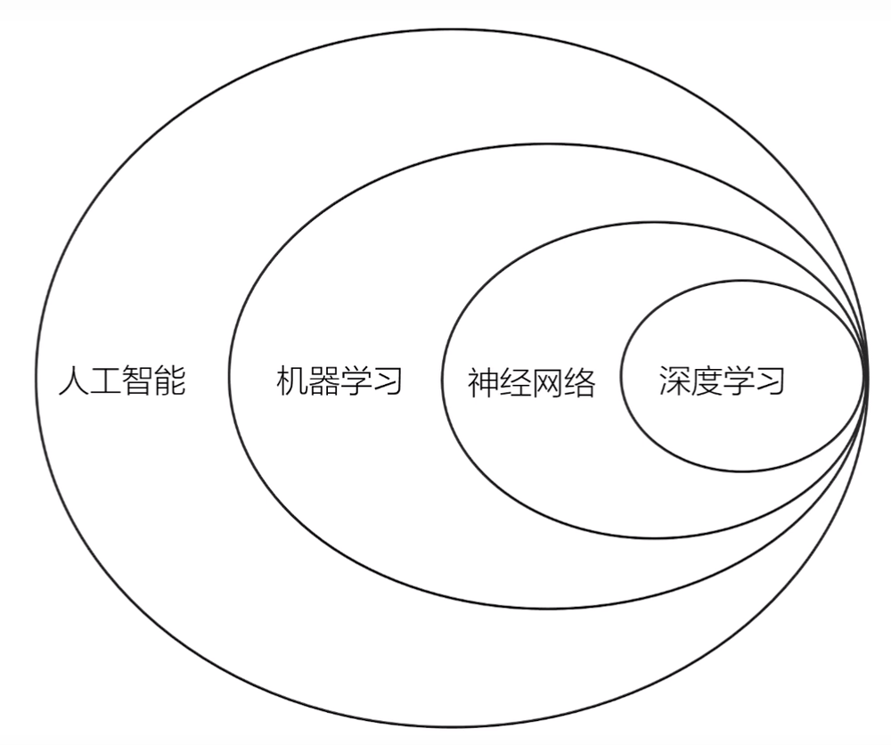

### 机器学习相关概念
- 机器学习是对能通过经验自动改进的计算机算法的研究；
- 机器学习使用数据或以往的经验，以此提升计算机程序的能力；
- 机器学习是研究如何通过计算的手段、利用经验来改善系统自身性能的一门学科；
- 典型机器学习过程如下：

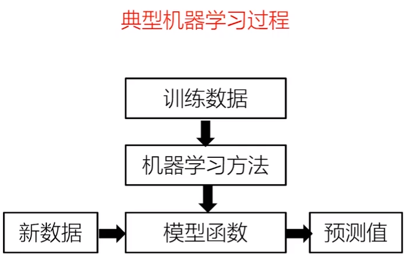

### 符号说明
1. 输入数据：$x$
2. 真实值（实际值）：$y$
3. 计算值（模型输出值）：$\hat{y}$
4. 模型函数：$H(x)$
5. 激活函数：$G(x)$
6. 损失函数：$L(x)$
7. 标量：斜体小写字母，$a$、$b$、$c$
8. 向量：黑斜体小写字母，$\boldsymbol{a}$、$\boldsymbol{b}$、$\boldsymbol{c}$
9. 矩阵：黑斜体大写字母，$\boldsymbol{A}$、$\boldsymbol{B}$、$\boldsymbol{C}$

### 线性回归
什么是回归(regression)和线性回归？

#### 单变量线性回归模型（一元）
线性回归可以找到一些**点的集合**背后的规律：一个点集可以用一条直线来拟合，这条拟合出来的直线的参数特征，就是线性回归找到的点集背后的规律。

单变量线性模型：$H_w(x)=w_0+wx$

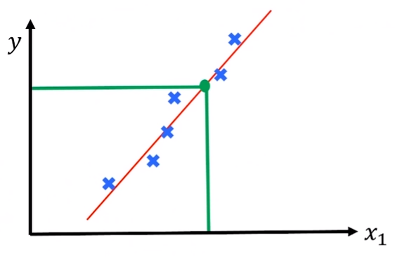

#### 多变量线性回归模型
两个特征：
$$H_w(x)=w_0+w_1x_1+w_2x_2$$
$n$个特征：$$H_w(x)=\sum^n_{i=0}w_ix_i=\hat{\boldsymbol{w}}^T\boldsymbol{x}, \quad \hat{\boldsymbol{w}}=[w_0; w_1; \cdots; w_n], \quad  \boldsymbol{x}=[x_0; x_1; \cdots; x_n],\quad x_0 = 1$$
线性函数拟合得好不好？模型预测值$\hat{y}$与真实值$y$存在误差：
$$\varepsilon = y - \hat{y} = y - \hat{\boldsymbol{w}}^T\boldsymbol{x}$$
$\varepsilon$满足$N(0,\sigma^2)$高斯分布→**最大似然估计**→损失函数：
$$L(\hat{\boldsymbol{w}})= \dfrac{1}{2} \displaystyle\sum^m_{j=1}(\hat{\boldsymbol{w}}^T\boldsymbol{x}-\boldsymbol{y}_j)^2$$
#### 寻找参数$\hat{\boldsymbol{w}}$，使得$L(\hat{\boldsymbol{w}})$最小
迭代法（梯度下降法）寻找参数：
1. 初始给定一个$\hat{\boldsymbol{w}}$，如$\boldsymbol{0}$向量或随机向量；
2. 沿着梯度下降的方向进行迭代，使更新后的$L(\hat{\boldsymbol{w}})$变小：
$$\hat{\boldsymbol{w}} = \hat{\boldsymbol{w}} - \alpha\dfrac{\partial{L(\hat{\boldsymbol{w}})}}{\partial{\hat{\boldsymbol{w}}}}$$
$\alpha$为学习率或步长，迭代至找到使得$L(\hat{\boldsymbol{w}})$最小的值$\hat{\boldsymbol{w}}$停止，从而得到回归模型参数。

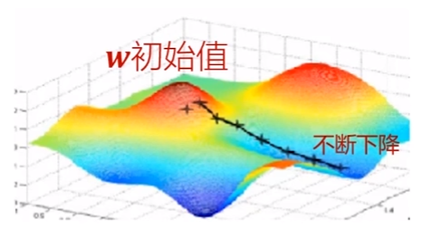

## 2.2 从机器学习到神经网络II
### 人工神经网络发展历程

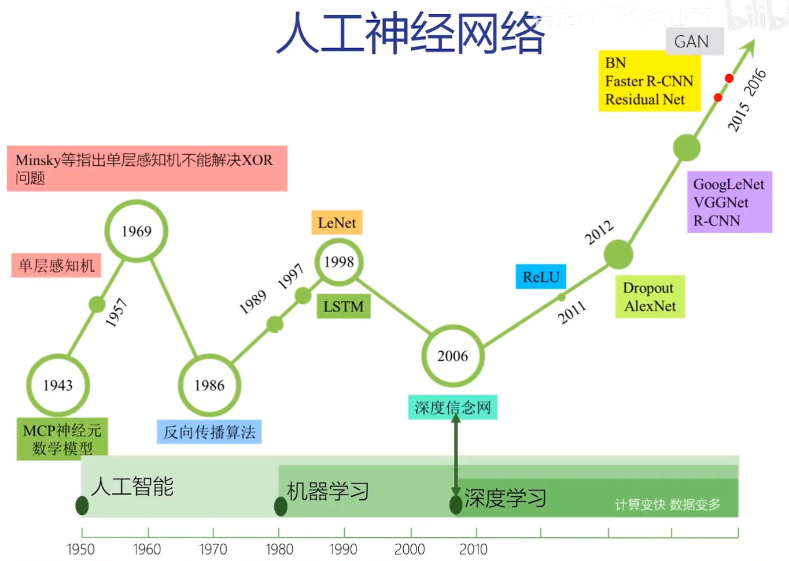

### 神经元模型
#### 生物神经元
生物学领域：
1. 一个生物神经元有多个树突（接受传入信息）；
2. 有一条轴突，轴突尾端有许多轴突末梢（给其他多个神经元传递信息）；
3. 轴突末梢和其他生物神经元的树突产生连接的位置为突触；

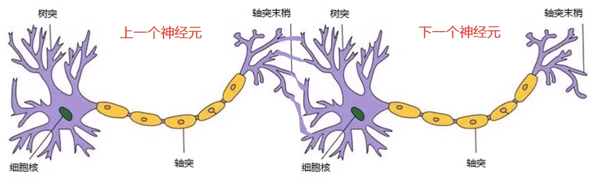

#### 人工神经元
机器学习领域，人工神经元是一个包含**输入、输出与计算功能的模型**。

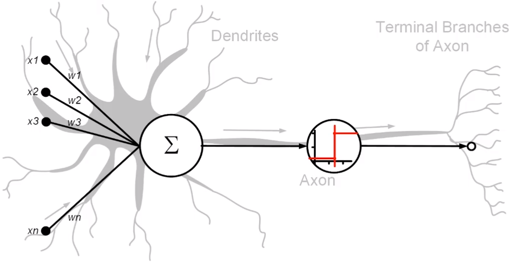

### 感知机(Perception)模型
$H(\boldsymbol{{x}})=sign(\boldsymbol{w}^T\boldsymbol{x}+b)$对应一个超平面$\boldsymbol{w}^T\boldsymbol{x}+b=0$，模型参数为：$(\boldsymbol{w}, b)$。感知机的目标是找到一个$(\boldsymbol{w}, b)$，将线性可分的数据集$T$中的所有样本正确分为两类。

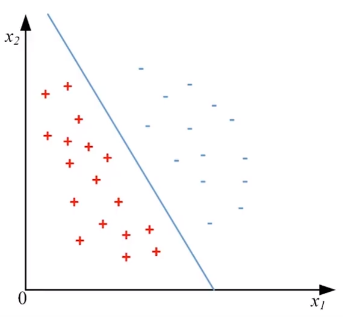

## 2.3 神经网络训练的基本原理
### 多层感知机
- 将大量的神经元模型进行组合，用不同的方法进行连接并作用在不同的激活函数上，则构成了人工神经网络模型
- 多层感知机一般指全连接的两层神经网络模型

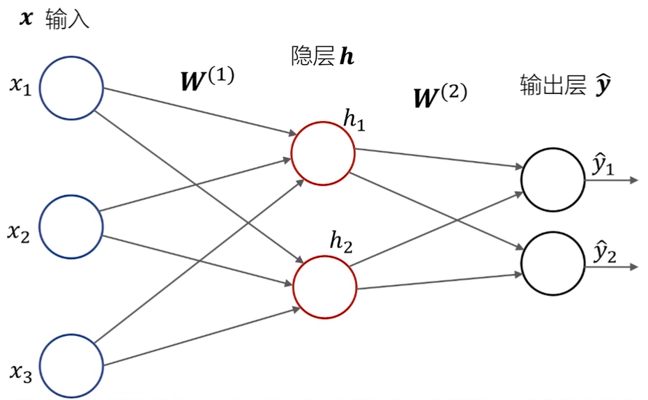

#### 偏置节点
在神经网络中，除了输出层之外，都会有一偏置单元$\boldsymbol{b}$，与后一层所有节点相连。$\boldsymbol{W}$称为权重，$\boldsymbol{b}$为权重，合称神经网络的参数。

### 浅层神经网络特点
1. 需要数据量小、训练快；
2. 其局限性在于对复杂函数的表示能力有限，针对复杂分类问题其泛化能力受制约；
3. 为什么不更深？Kurt Hornik证明了理论上两层神经网络足以拟合任意函数，过去也没有足够的数据和计算能力；

### 深度神经网络的成功
一些外在因素：
- 算法，优化算法层出不穷
- 数据量不断增大
- 处理器计算能力不断提升

#### 多层神经网络
- 随着层数不断增加，每层对于迁移层次的抽象表示更为深入，每层神经元学习到的是前一层神经元更抽象的表示；
- 通过抽取更抽象的特征来对事物进行区分，从而获得更好的区分与分类能力；

### 神经网络的模型训练
目的：使得参数尽可能地与真实的模型逼近
- 正向传播（推断）：根据输入，经过**权重、激活函数计算出隐层**，将输入的特征向量从低级特征逐步提取为抽象特征，直到得到最终输出结果的过程；

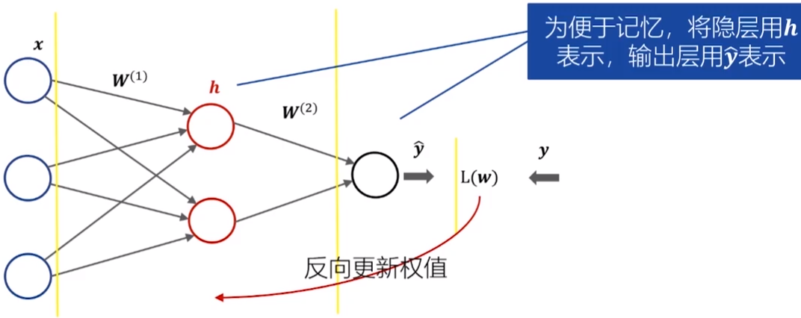
- 反向传播
	- 根据正向传播的**输出结果**和期望值计算出的**损失函数**，再通过**链式求导**，最终**从网络后端**逐步修改权重，使得**输出和期望值的差距变到最小**的过程；
	- 将NN的输出误差反向传播到输入端，以此更新NN中各个连接的权重；
	- 当第一次反向传播完成后，NN的模型参数得到更新，网络进行下一轮正向传播。如此反复迭代进行训练，从而不断缩小误差；

## 2.4 神经网络的设计原则
改进：
- 调整网络拓扑结构
- 选择合适的激活函数
- 选择合适的损失函数

### 神经网络的拓扑调节
NN的一般结构：输入x隐层x输出层
- 输入：神经元个数=特征维度
- 输出：神经元个数=分类类别数
- 隐层：隐层的数量？神经元的个数？
- 隐层的设计：
	- 作用：提取输入特征的隐藏规律，每个节点都赋予一定权重；
	- 节点太少，NN从样本中获取信息的能力越差，无法反应数据集规律；
	- 节点过多，NN拟合能力太强，可能拟合数据集中的噪声部分，导致泛化能力变差；

### 选择合适的激活函数
- 在神经元中，输入的数据通过加权求和后，还被作用了一个函数$G$，这就是激活函数(Activation Function)。
- 激活函数给神经元引入非线性因素，使得NN可逼近任何非线性函数，因此NN可应用到众多的非线性模型中
- 激活函数需具备的性质：
	1. 可微性：当优化方法是基于梯度时；
	2. 输出值的范围：当激活函数输出值是有限时，基于梯度的优化方法更稳定，因为特征的表示受有限权值的影响更显著；当激活函数输出值是无限时，模型训练更加高效；

#### Sigmoid函数
$$\sigma(x)=\dfrac{1}{1+e^{-x}}$$
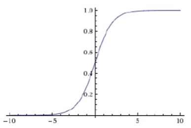
- 非0均值的输出，导致$w$计算的梯度始终为正
- 计算机进行指数运算速度慢
- **饱和性问题、梯度消失**

#### $\tanh$函数
$$\tanh(x)=\dfrac{\sinh(x)}{\cosh(x)}=\dfrac{e^x-e^{-x}}{e^x+e^{-x}}$$
$$\tanh(x)=2sigmoid(2x)-1$$
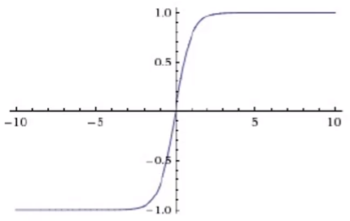
- 与Sigmoid相比，$\tanh$是0均值的；
- 在输入很大/小时，输出几乎平滑，梯度很小，**不利于权重更新**；

#### ReLU函数
$$f(x)=\max (0, x)$$
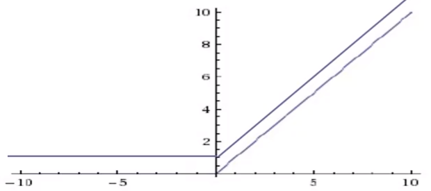
- ReLU能在$x>0$时保持梯度不衰减，从而**缓解梯度消失**问题；
- ReLU死掉。若学习率很大，反向传播后的参数可能为负，导致下一轮正向传播输入为负数。当输入为负数，ReLU是**完全不被激活的**，这表明一旦输入到了负数，ReLU会死掉；
- 输出范围是无限的；

#### PReLU/Leaky ReLU函数
ReLU在$x<0$时完全不被激活→改进Leaky ReLU
$$f(x)=\max (\alpha x, x), \quad \alpha \in (0, 1)$$

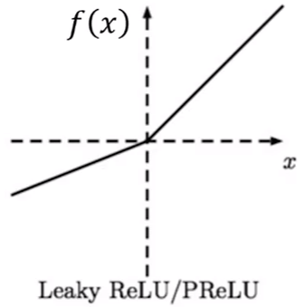
- 负数区域内，Leaky ReLU有很小斜率，避免死掉；
- PReLU定义类似，$\alpha$为可调参数，每个通道有一个$\alpha$，反向传播训练得到；

#### EReLU(Exponential)
融合Sigmoid与ReLU：

$$f(x)=\left\{\begin{matrix} x&, x>0\\ \alpha(e^x-1)&, x\le 0\end{matrix}\right.$$

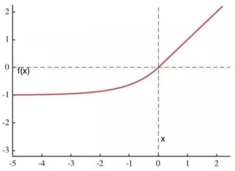
- $\alpha$是可调参数，控制ELU在负值区间的饱和位置；
- ELU的输出均值接近0，收敛速度快；
- 右侧线性部分使得ELU能**缓解梯度消失**，左侧软饱和能对输入变化或噪声更鲁棒，避免神经元死掉；

### 常用损失函数
#### 均方差
$$L=\dfrac{1}{2}(y-\hat{y})^2$$

若使用Sigmoid作为激活函数，则$\hat{y}=\sigma(z)$，其中$z=wx+b$，

$$\dfrac{\partial L}{\partial \boldsymbol{w}}=(y-\hat{y})\sigma'(z)x$$
$$\dfrac{\partial L}{\partial b}=(y-\hat{y})\sigma'(z)$$
$$\sigma'(z)=(1-\sigma(z))\cdot \sigma(z)$$
⚠️ 出现问题：所求的$\dfrac{\partial L}{\partial w}$与$\dfrac{\partial L}{\partial b}$均有$\sigma'(z)$，当神经元输出接近1时，梯度趋近于0，出现**梯度消失**，导致NN**反向传播参数更新缓慢**，学习效率下降。

#### 交叉熵
交叉熵+Sigmoid激活函数解决输出层神经元学习率缓慢问题。

$$L=-\dfrac{1}{m}\displaystyle\sum_{\boldsymbol{x}\in D}\sum_i y_i \ln(\hat{y}_i)$$
$m$为训练样本总数，$i$为分类类别。二分类为例：

$$L=-\dfrac{1}{m}\displaystyle\sum_{\boldsymbol{x}\in D}(y\ln(\hat{y})+(1-y)\ln(1-\hat{y}))$$
再使用Sigmoid激活函数时：

$$\hat{y}=\sigma(z)=\dfrac{1}{1+e^{-z}}=\dfrac{1}{1+e^{-(\boldsymbol{w}^T\boldsymbol{x}+b)}}$$

根据$\sigma'(z)=(1-\sigma(z))\cdot \sigma(z)$，可推导：

$$\dfrac{\partial L}{\partial \boldsymbol{w}}=-\dfrac{1}{m}\displaystyle\sum_{x\in D}(\sigma(z)-y)\cdot \boldsymbol{x}$$
$$\dfrac{\partial L}{\partial b}=-\dfrac{1}{m}\displaystyle\sum_{\boldsymbol{x}\in D}(\sigma(z)-y)$$
最后一层的梯度不含$\sigma'(z)$。

#### 补充：Softmax损失函数的反向传播

设$X=[x_1,x_2,\cdots,x_n]$，$Y=softmax(X)=[y_1,y_2,\cdots,y_n]$，则有：

$$\hat{y}_i=\dfrac{e^{x_i}}{\displaystyle\sum_{j=1}^n e^{x_{j}}}$$

交叉熵：$L=-\displaystyle\sum^n_{i=1}y_i\ln\hat{y}_i$
1. 当$i=j$时，

$$\dfrac{\partial \hat{y}_i}{\partial x_j}=\dfrac{\partial \hat{y}_i}{\partial x_i}$$

$$=\dfrac{\partial}{\partial x_i}\cdot\dfrac{e^{x_i}}{\sum_k e^{x_k}}$$

$$=\dfrac{(\partial e^{x_i}/\partial x_i)(\sum_k e^{x_k})-e^{x_i}(\partial\sum_k e^{x_k}/\partial x_i)}{(\sum_k e^{x_k})^2}$$

$$=\dfrac{e^{x_i}(\sum_k e^{x_k})}{(\sum_k e^{x_k})^2}-\dfrac{e^{x_i}\cdot e^{x_i}}{(\sum_k e^{x_k})^2}$$

$$=\dfrac{e^{x_i}}{\sum_k e^{x_k}}-\left(\dfrac{e^{x_i}}{\sum_k e^{x_k}}\right)^2$$

$$=\hat{y}_i-\hat{y}_i^2$$

$$=\hat{y}_i(1-\hat{y}_i)$$

2. 当$i\neq j$时，

$$\dfrac{\partial \hat{y}_i}{\partial x_j}=\dfrac{\partial}{\partial x_j}\cdot\dfrac{e^{x_i}}{\sum_k e^{x_k}}$$

$$=\dfrac{(\partial e^{x_i}/\partial x_j)(\sum_k e^{x_k})-e^{x_i}(\partial\sum_k e^{x_k}/\partial x_j)}{(\sum_k e^{x_k})^2}$$

$$=\dfrac{0\cdot(\sum_k e^{x_k})-e^{x_i}\cdot e^{x_j}}{(\sum_k e^{x_k})^2}$$

$$=\dfrac{-e^{x_i}\cdot e^{x_j}}{(\sum_k e^{x_k})^2}$$

$$=-\dfrac{e^{x_i}}{\sum_k e^{x_k}}\cdot\dfrac{e^{x_j}}{\sum_k e^{x_k}}$$

$$=-\hat{y}_i\hat{y}_j$$

$$\because \dfrac{\partial L}{\partial \hat{y}_i}=-\dfrac{y_i}{\hat{y}_i}$$

$$\therefore \dfrac{\partial L}{\partial x_i}=\displaystyle\sum_{j=1}^n\dfrac{\partial L}{\partial \hat{y}_j}\cdot\dfrac{\partial \hat{y}_j}{\partial x_i}$$

$$=-\displaystyle\sum_{j=1}^n\dfrac{y_j}{\hat{y}_j}\cdot\dfrac{\partial \hat{y}_j}{\partial x_i}$$

$$=-\dfrac{y_i}{\hat{y}_i}\cdot\dfrac{\partial \hat{y}_i}{\partial x_i}-\displaystyle\sum_{j=1,j\neq i}^n\dfrac{y_j}{y_j}\cdot\dfrac{\partial \hat{y}_j}{\partial x_i}$$

$$=-\dfrac{y_i}{\hat{y_i}}\cdot\hat{y}_i(1-\hat{y}_i)-\displaystyle\sum_{j=1,j\neq i}^n(-y_j \hat{y}_i)$$

$$=-y_i+y_i \hat{y}_i+\displaystyle\sum_{j=1,j\neq i}^n y_j \hat{y}_i$$

$$=-y_i+\displaystyle\sum_{j=1}^n y_j \hat{y}_i$$

$$=-y_i+\hat{y}_i\displaystyle\sum_{j=1}^ny_j$$

$$\because \displaystyle\sum_{j=1}^n y_j=1$$

$$=\hat{y}_i-y_i$$

### 损失函数特性
- 同一算法损失函数不唯一
- 是参数$w,b$ 的函数
- 损失函数可评价模型好坏
- 是一个标量
- 挑选对$(w, b)$ 可微的函数
- 又称代价函数、目标函数

## 2.5 过拟合与正则化
### 泛化
定义：机器学习不仅要求在训练集上求得较小误差，在测试集上也要表现好。
- 欠拟合：训练的特征少，误差大；
- 过拟合：特征维度多，拟合函数完美接近训练集，泛化能力差，对新数据预测能力差；

**参数范数惩罚、稀疏化、Bagging继承、Dropout、提前终止、数据集扩增**等正则化方法可有效抑制过拟合。

#### 正则化
拟合函数：$w_0+w_1 x+w_2 x^2$
过拟合：$w_0+w_1 x+w_2 x^2+w_3 x^3+w_4 x^4$

加**惩罚项**，使得$w_3$、$w_4$足够小

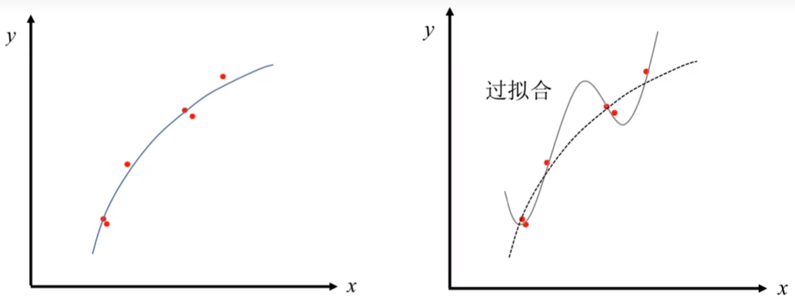

目标函数：

$$L(\boldsymbol{w})=\dfrac{1}{2m}\displaystyle\sum^m_{i=1}\parallel \boldsymbol{y}_i-\hat{\boldsymbol{y}}_i\parallel^2$$

$$\min\limits_\boldsymbol{w}\dfrac{1}{2m}\displaystyle\sum^m_{i=1}\parallel \boldsymbol{y}_i-\hat{\boldsymbol{y}}_i\parallel^2+C_1\cdot w_3^2+C_2\cdot w_4^2$$
$C_1$、$C_2$取常数且很大，例如，1000；
正则化项为：$\theta\displaystyle\sum^k_{j=1}w_j^2$，$\theta$为正则化参数，正则化工程仅对权重$w$进行惩罚，正则化项记为：$\Omega(\boldsymbol{w})$
正则化后的损失函数记为：
$$\widetilde{L}(\boldsymbol{w};\boldsymbol{X}, \boldsymbol{y})=\boldsymbol{L}(\boldsymbol{w};\boldsymbol{X}, \boldsymbol{y})+\theta\Omega(\boldsymbol{w})$$

#### $L^2$正则化
$L^2$正则化项：
$$\Omega(\boldsymbol{w})=\dfrac{1}{2}\parallel w\parallel^2_2$$
目标函数：
$$\widetilde{L}(\boldsymbol{w};\boldsymbol{X}, \boldsymbol{y})=L(\boldsymbol{w};\boldsymbol{X}, \boldsymbol{y})+\dfrac{\theta}{2}\parallel \boldsymbol{w}\parallel^2_2$$
$$\nabla_{\boldsymbol{w}}\widetilde{L}(\boldsymbol{w};\boldsymbol{X}, \boldsymbol{y})=\nabla_{\boldsymbol{w}}L(\boldsymbol{w};\boldsymbol{X}, \boldsymbol{y})+\theta\boldsymbol{w}$$
$L^2$正则化如何避免过拟合：过拟合时某些区间的导数值非常大，通过$L^2$正则化，$w$权重变小，网络复杂度降低，对数据拟合更好。

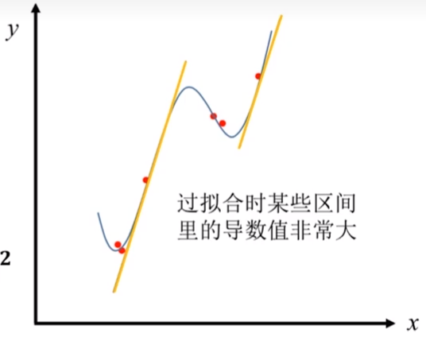

#### $L^1$正则化
$L^1$正则化项是各个参数绝对值之和：
$$\Omega(\boldsymbol{w})=\parallel \boldsymbol{w}\parallel_1=\displaystyle\sum_i\lvert w_i\rvert$$
目标函数：
$$\widetilde{L}(\boldsymbol{w};\boldsymbol{X}, \boldsymbol{y})=L(\boldsymbol{w};\boldsymbol{X}, \boldsymbol{y})+\theta\parallel \boldsymbol{w}\parallel_1$$
$$\nabla_{\boldsymbol{w}}\widetilde{L}(\boldsymbol{w};\boldsymbol{X}, \boldsymbol{y})=\nabla_{\boldsymbol{w}}L(\boldsymbol{w};\boldsymbol{X}, \boldsymbol{y})+\theta sign(\boldsymbol{w})$$
$L^1$正则化通过加入**符号函数**，使得当$w_i$为正时，更新后的$w_i$变小，当$w_i$为负时，更新后的$w_i$变大，因此让$w_i$接近0。如此，网络中的权重接近0，从而减小网络复杂度，防止过拟合。

#### Bagging集成方法
- 训练不同的模型**共同决策**，不同的模型即使在一数据集上也会产生不同误差；
- 可**多次重复使用**同一模型，训练算法和目标函数进行训练；
- 数据集从原始数据中**重复采样获取**，大小与原始数据集保持一致；
- **模型平均**是减小泛化误差的一种可靠方法；

#### Dropout正则化
$L^2$、 $L^1$正则化通过在目标函数中增加惩罚项实现，Dropout正则化通过在训练时暂时修改NN来实现，随机删除一些隐层单元，在计算时无视其连接。

#### 其他正则化方法
提前终止、多任务学习、数据集增强、参数共享、稀疏表示……

## 2.6 交叉验证
- 给每个样本作为测试集和训练集的机会，充分利用样本信息，保证了鲁棒性，防止过拟合；
- 选择多种模型进行训练时，使用交叉验证能评判各模型的鲁棒性；

### 最简单的验证方式

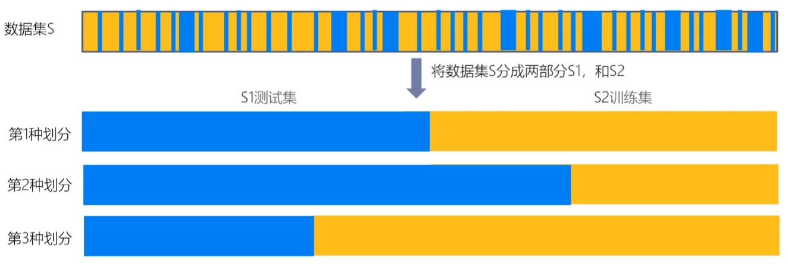
缺点：不同划分方式下，得到的MSE变动较大。最终模型与参数的选取**极大程度依赖**训练集和测试集的划分方法，只有部分数据参与了模型训练。

### Leave-one-out交叉验证

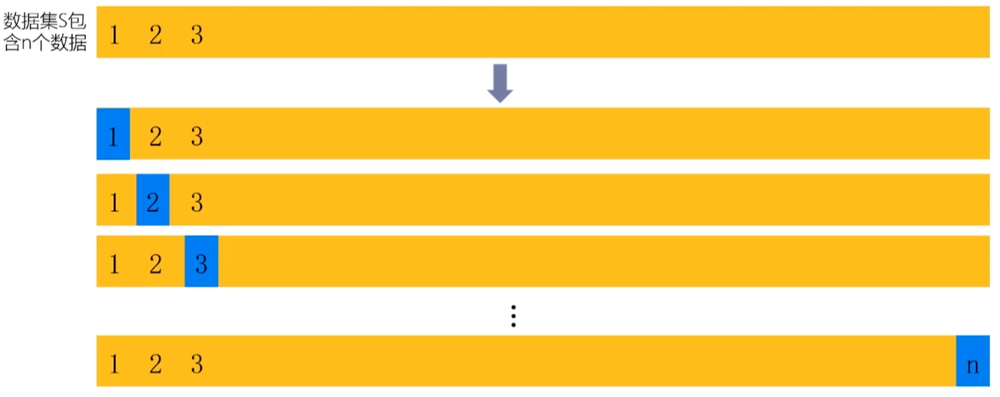

每次取出一个数据作为测试集的唯一元素，而其他$n-1$数据作为训练集。最终训练出$n$个模型，得到$n$个MSE，取平均。

缺点：计算量过大，耗时。

### K折交叉验证

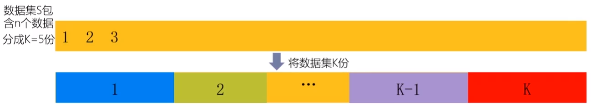

不重复地每次取一份做测试集，其余$K-1$份做训练集，之后计算在测试集上的$MSE_i$，最终取平均：
$$MSE=\dfrac{1}{K}\displaystyle\sum^K_{i=1}MSE_i$$
优点：所有样本都被作为测试集和训练集，每个样本都被验证一次。比LOO交叉验证，计算成本和耗时均降低。