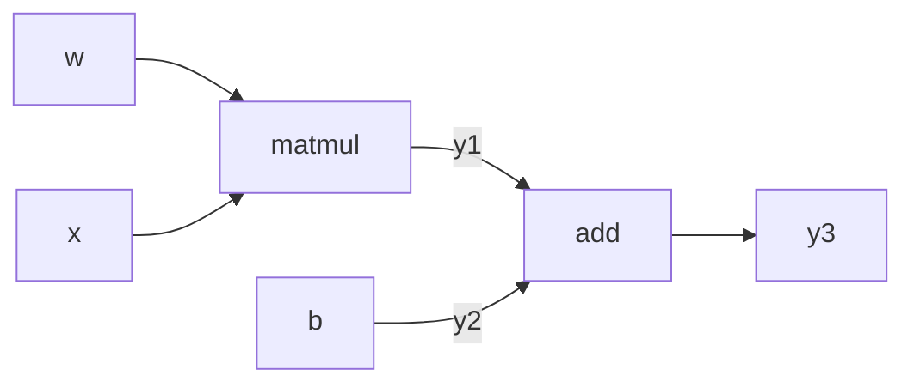
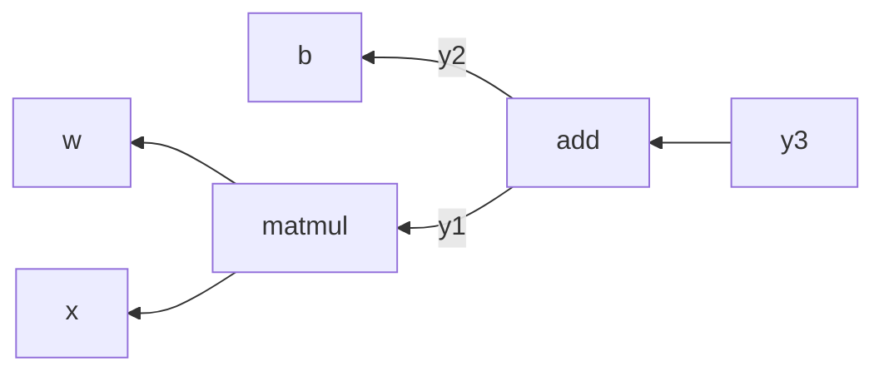
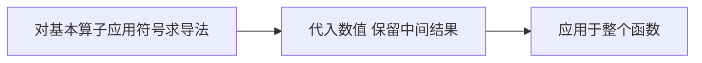

# Chapter 5 编程框架机理
## 5.1 TF设计原则
1. 高性能
	- TF算子，设计过程中已针对底层硬件架构进行了充分优化；
	- 针对生成的计算图，TF又提供了一系列优化操作，以提升计算图的运行效率；
	- TF调度器可以根据网络结构特点，并发运行没有数据依赖的节点，例如：
```python
import tensorflow as tf
a = tf.constant(1.0)
b = tf.constant(2.0)
c = tf.sin(a)
d = tf.cos(b)
e = tf.add(c, d) # 张量c, d可以并发执行

with tf.Session() as sess:
	sess.run(e)
```
2. 易开发
	- TF针对现有多种深度学习算法，提取大量的共性运算，并封装成算子；
	- 用户使用TF进行算法开发时，能直接调用这些算子，很方便地实现算法；
3. 可移植
	- TF可工作于各种类型的异构系统；
	- 对每个算子（例如矩阵乘法）需提供在不同设备上的不同底层实现；
	- 通过上述机制，使得统一的用户程序可以在不同硬件平台上执行；

## 5.2 TF计算图机制
### 计算图的自动求导
- 深度学习中采用**梯度下降法**更新模型参数；
- 梯度计算比较直观，但对于复杂模型，手动计算梯度非常困难；
- 目前大部分深度学习框架均提供自动梯度计算功能；
- 用户只需描述**前向计算的过程**，由变成框架自动推导反向计算图，完成导数计算；

常用求导方法：
- 手动求解
	- 即传统的反向传播法：手动用链式法则求解出梯度公式，代入数值，得到最终梯度值；
	- 缺点：
		  1. 对于大规模的深度学习计算，手动用链式法则进行梯度计算并转换成计算机程序困难；
		  2. 需要手动编写梯度求解代码；
		  3. 每次修改算法模型，都要修改对应的梯度求解算法；


- 数值求导：一开始直接代入数值近似求解
	- 利用导数的原始定义求解：
	$$f'(x)=\displaystyle\lim_{h\rightarrow 0}\dfrac{f(x+h)-f(x)}{h}$$
	- 优点：
		  1. 易操作；
		  2. 可对用户隐藏求解过程；
	- 缺点：
		1. 计算量大，求解速度慢；
		2. 可能引入舍入误差和截断误差；
- 符号求导法：直接对代数表达式求解，最后才代入数字
	- 利用求导规则来对表达式进行自动操作，从而获得导数；
	- 常见求导规则：
	$$\dfrac{d}{dx}\left(f(x)+g(x)\right)=\dfrac{d}{dx}f(x)+\dfrac{d}{dx}g(x)$$$$\dfrac{d}{dx}f(x)g(x)=\left(\dfrac{d}{dx}f(x)\right)g(x)+f(x)\left(\dfrac{d}{dx}g(x)\right)$$$$\dfrac{d}{dx}\dfrac{f(x)}{g(x)}=\dfrac{f'(x)g(x)-f(x)g'(x)}{g(x)^2}$$

	- 缺点：表达式膨胀问题；
- 自动求导法：介于数值求导和符号求导的方法；
	- 计算图结构天然适用于自动求导：计算图将多输入的复杂计算表达成了由多个基本二元计算组成的**有向图**，并保留了所有中间变量，有助于程序自动利用链式法则进行求导；
	- 优点
		1. 灵活，可以完全向用户隐藏求导过程；
		2. 只对基本函数运用符号求导法，因此可以灵活结合变成语言的循环结构、条件结构等；

- TensorFlow中注册`Sin(x)` 函数的反向求导方法
```python
@ops.RegisterGradient("Sin")
def _SinGrad(op, grad):
'''Returns grad * cos(x)'''
x = op.inputs[0]
with ops.control_dependencies([grad]):
	x = math_ops.conj(x)

return grad * math_ops.cos(x)
```
- TensorFlow会自动生成对应的反向计算节点，并将其加入到计算图中
- 计算分两步执行：
	1. 原始函数建立计算图，数据正向传播，计算出中间节点$x_i$，并记录计算图中的节点依赖关系
	2. 反向遍历计算图，计算输出对于每个节点的导数	$$\overline{x}_i=\dfrac{\partial y_j}{\partial x_i}$$
- 对于前向计算中一个数据$(x_i)$连接多个输出数据$(y_j、y_k)$的情况，自动求导中，将这些输出数据相对于该数据的导数**累加**：
$$\overline{x}_i=\overline{y}_j\dfrac{\partial y_j}{\partial x_i}+\overline{y}_k\dfrac{\partial y_k}{\partial x_i}$$

示例：$f(x_1, x_2)=(e^{x_1}+x_2)(x_2+1)$
- 正向计算


- 反向计算


对比：
  |   方法   | 对图的遍历次数 | 精度 |             备注             |
  | :------: | :------------: | :--: | :--------------------------: |
  | 手动求解 |       NA       |  高  |             实现复杂             |
  | 数值求导 |    $n_I+1$     |  低  |         计算量大，慢         |
  | 符号求导 |       NA       |  高  |          表达式膨胀          |
  | 自动求导 |    $n_O+1$     |  高  | 对输入维度较大的情况优势明显 |
其中：
- $n_I$：要求导的神经网络层的输入变量数，包括$w$、$x$、$b$；
- $n_O$：神经网络层的输出个数；

### 检查点机制
- 在模型训练过程中，使用`tf.train.Saver()` 来保存模型中的所有变量；
- 当需要基于摸个checkpoint继续训练模型参数时，需要从`.ckpt` 文件中恢复出已保存的变量，同样使用`tf.train.Saver()`来恢复变量，恢复变量时不需要先初始化变量；
- TensorFlow通过向计算图中插入Save节点机器关联节点来完成保存模型的功能；
- 在恢复模型时，也是通过在计算图中插入Restore节点机器关联节点来完成；

### TensorFlow中的控制流
- TensorFlow中使用控制流算子来实现不同复杂控制流场景；
- 通过引入少量简单基础操作，为多样的TF应用提供丰富控制流表达；
- 在TF中，每一个操作都会在一个**执行帧**中被执行，控制流操作负责创建和管理这些执行帧；

- Switch：一个Switch操作根据控制输入$p$的布尔值，将一个输入张量$d$推进到某一个输出（二选一）；

- Merge：Merge操作将它的其中一个输入推向输出。当一个Merge操作的任意一个输入准备好后，Merge操作会执行；

- Enter(name)：Enter操作将它的输入推向名为name的执行帧；

- Exit：Exit操作，将一个张量从一个子执行帧推向它的父执行帧。他的作用是将张量从子执行帧返回给父执行帧；

- NextIteration
	1. 将一个张量从当前执行帧的一轮迭代传递到下一轮迭代；
	2. 在一个执行帧中可能会有多个NextIteration操作。当执行帧的第$N$轮执行的第一个 NextIteration开始执行时，TF的运行时开始执行第$N+1$轮的迭代；
	3. 当更多的张量通过了NextIteration操作进入新的执行轮次时，新执行轮次中更多的操作就会开始运行。当输入准备完成之后， NextIteration操作开始执行；


### 控制流结构的编译——条件表达式
- `cond(pred, true_fn, false_fn)`

```python
tf.cond(x>y, lambda: tf.substract(x,y), lambda: tf.add(x,x)）
```

### 计算图的执行模式

- client：tongguo session接口与master和worker接口通信，worker可以是一个或多个；
- master：控制所有worker按照计算图执行；
- worker：每一个worker负责一个或多个计算设备的仲裁访问，并根据master指令，执行计算图节点；
- 设备：CPU或GPU；

### 分布式执行

client、master、worker工作与不同机器上的不同进程中；

### 计算图本地执行

1. 计算图剪枝：得到本地运行的最小子图；
2. 计算图分配：多设备，保证计算快速执行；
3. 计算图优化；
   1. 常量折叠；
   2. 算数优化；
   3. 布局优化；
   4. 重映射：算子融合，将出现频率较高的子图用一单独算子代替；
4. 计算图切分；

### 计算图分布式执行

- 神经网络规模和数据规模指数级增加；
- 提高训练效率，采用分布式技术：将大CNN拆分成许多小的部分，同时分配在多个节点上进行计算；

### 分布式通信

- 点到点通信；
- 集合通信；

### 容错机制

确保分布式系统的稳定；

- 检查Send和Recv节点传输的正确性；
- 定期检查每个工作机的状态；
- 检查到错误时，计算图执行过程停止并重启；
- 训练过程中会保存中间状态，用于恢复；

## 5.3 TF系统实现

### 整体架构

### 计算图执行模块

### 执行器逻辑

执行流：一个能存储计算任务的队列；流间任务可以并行执行，流内任务串行执行；

### 设备抽象和管理

- TF将设备分为本地设备、远程设备；

- TF使用注册机制管理设备。每个设备负责一个子图运算，通过注册接口支持自定义设备；

### 算子实现

略