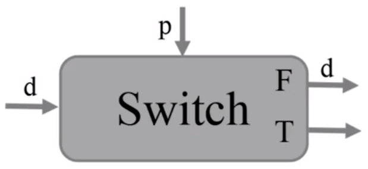
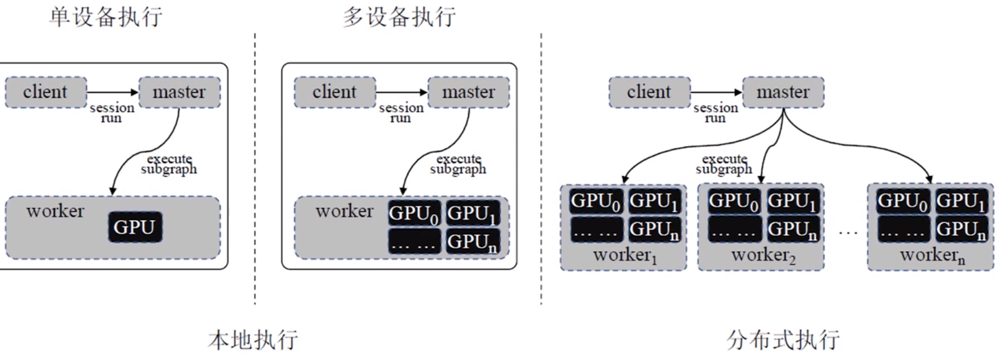

# Chapter 5 编程框架机理
Revison：3

## 5.1 TF设计原则
1. 高性能
   - TF算子，设计过程中已针对底层硬件架构进行了充分优化；
   - 针对生成的计算图，TF又提供了一系列优化操作，以提升计算图的运行效率；
   - TF调度器可以根据网络结构特点，并发运行没有数据依赖的节点，例如：

```python
import tensorflow as tf
a = tf.constant(1.0)
b = tf.constant(2.0)
c = tf.sin(a)
d = tf.cos(b)
e = tf.add(c, d) # 张量c, d可以并发执行

with tf.Session() as sess:
	sess.run(e)
```

2. 易开发
   - TF针对现有多种深度学习算法，提取大量的共性运算，并封装成算子；
   - 用户使用TF进行算法开发时，能直接调用这些算子，很方便地实现算法；
3. 可移植
   - TF可工作于各种类型的异构系统；
   - 对每个算子（例如矩阵乘法）需提供在不同设备上的不同底层实现；
   - 通过上述机制，使得统一的用户程序可以在不同硬件平台上执行；

## 5.2 TF计算图机制

### 计算图的自动求导

- 深度学习中采用**梯度下降法**更新模型参数；
- 梯度计算比较直观，但对于复杂模型，手动计算梯度非常困难；
- 目前大部分深度学习框架均提供自动梯度计算功能；
- 用户只需描述**前向计算的过程**，由变成框架自动推导反向计算图，完成导数计算；

常用求导方法：

- 手动求解
  - 即传统的反向传播法：手动用链式法则求解出梯度公式，代入数值，得到最终梯度值；
  - 缺点：
    1. 对于大规模的深度学习计算，手动用链式法则进行梯度计算并转换成计算机程序困难；
    2. 需要手动编写梯度求解代码；
    3. 每次修改算法模型，都要修改对应的梯度求解算法；


- 数值求导：一开始直接代入数值近似求解
	- 利用导数的原始定义求解：
$$(x)=\displaystyle\lim_{h\rightarrow 0}\dfrac{f(x+h)-f(x)}{h}$$
  - 优点：
    1. 易操作；
    2. 可对用户隐藏求解过程；
  - 缺点：
    1. 计算量大，求解速度慢；
    2. 可能引入舍入误差和截断误差；
- 符号求导法：直接对代数表达式求解，最后才代入数字
	- 利用求导规则来对表达式进行自动操作，从而获得导数；
	- 缺点：表达式膨胀问题；
	- 常见求导规则：
$$frac{d}{dx}\left(f(x)+g(x)\right)=\dfrac{d}{dx}f(x)+\dfrac{d}{dx}g(x)$$
$$\dfrac{d}{dx}f(x)g(x)=\left(\dfrac{d}{dx}f(x)\right)g(x)+f(x)\left(\dfrac{d}{dx}g(x)\right)$$
$$\dfrac{d}{dx}\dfrac{f(x)}{g(x)}=\dfrac{f'(x)g(x)-f(x)g'(x)}{g(x)^2}$$
- 自动求导法：介于数值求导和符号求导的方法；
	- 计算图结构天然适用于自动求导：计算图将多输入的复杂计算表达成了由多个基本二元计算组成的**有向图**，并保留了所有中间变量，有助于程序自动利用链式法则进行求导；
  - 优点
	1. 灵活，可以完全向用户隐藏求导过程；
	2. 只对基本函数运用符号求导法，因此可以灵活结合变成语言的循环结构、条件结构等；


- TF中注册 `Sin(x)` 函数的反向求导方法

```python
@ops.RegisterGradient("Sin")
def _SinGrad(op, grad):
'''Returns grad * cos(x)'''
x = op.inputs[0]
with ops.control_dependencies([grad]):
	x = math_ops.conj(x)

return grad * math_ops.cos(x)
```

- TF会自动生成对应的反向计算节点，并将其加入到计算图中
- 计算分两步执行：
	1. 原始函数建立计算图，数据正向传播，计算出中间节点$x_i$，并记录计算图中的节点依赖关系
	2. 反向遍历计算图，计算输出对于每个节点的导数	
$$\overline{x}_i=\dfrac{\partial y_j}{\partial x_i}$$
- 对于前向计算中一个数据$(x_i)$连接多个输出数据$(y_j、y_k)$的情况，自动求导中，将这些输出数据相对于该数据的导数**累加**：

$$\overline{x}_i=\overline{y}_j\dfrac{\partial y_j}{\partial x_i}+\overline{y}_k\dfrac{\partial y_k}{\partial x_i}$$
示例：
$$f(x_1, x_2)=(e^{x_1}+x_2)(x_2+1)$$
- 正向计算


  
- 反向计算


  

对比：
|   方法   | 对图的遍历次数 | 精度 |             备注             |
| :------: | :------------: | :--: | :--------------------------: |
| 手动求解 |       NA       |  高  |           实现复杂           |
| 数值求导 |   $n_I+1$   |  低  |         计算量大，慢         |
| 符号求导 |       NA       |  高  |          表达式膨胀          |
| 自动求导 |   $n_O+1$   |  高  | 对输入维度较大的情况优势明显 |

其中，
- $n_I$：要求导的神经网络层的输入变量数，包括$w$、$x$、$b$；
- $n_O$：神经网络层的输出个数；

### 检查点机制
- 在模型训练过程中，使用 `tf.train.Saver()` 来保存模型中的所有变量；
- 当需要基于摸个checkpoint继续训练模型参数时，需要从 `.ckpt` 文件中恢复出已保存的变量，同样使用 `tf.train.Saver()`来恢复变量，恢复变量时不需要先初始化变量；
- TF通过向计算图中插入Save节点机器关联节点来完成保存模型的功能；
- 在恢复模型时，也是通过在计算图中插入Restore节点机器关联节点来完成；

### TensorFlow中的控制流
- TF中使用控制流算子来实现不同复杂控制流场景；
- 通过引入少量简单基础操作，为多样的TF应用提供丰富控制流表达；
- 在TF中，每一个操作都会在一个**执行帧**中被执行，控制流操作负责创建和管理这些执行帧；
- Switch：一个Switch操作根据控制输入$p$的布尔值，将一个输入张量$d$推进到某一个输出（二选一）；
  
- Merge：Merge操作将它的其中一个输入推向输出。当一个Merge操作的任意一个输入准备好后，Merge操作会执行；
  
- Enter(name)：Enter操作将它的输入推向名为name的执行帧；
  
- Exit：Exit操作，将一个张量从一个子执行帧推向它的父执行帧。他的作用是将张量从子执行帧返回给父执行帧；
	
- NextIteration
	1. 将一个张量从当前执行帧的一轮迭代传递到下一轮迭代；
	2. 在一个执行帧中可能会有多个NextIteration操作。当执行帧的第$N$轮执行的第一个 NextIteration开始执行时，TF的运行时开始执行第$N+1$轮的迭代；
	3. 当更多的张量通过了NextIteration操作进入新的执行轮次时，新执行轮次中更多的操作就会开始运行。当输入准备完成之后， NextIteration操作开始执行；
	
		

#### 控制流结构的编译
1. 条件表达式：`cond(pred, true_fn, false_fn)`


```python
tf.cond(x>y, lambda: tf.substract(x,y), lambda: tf.add(x,x)）
```

2. 循环操作：`while_loop(pred, body, loop_vars)`

	

```python
tf.while_loop(lambda i: i<16, lambda i: tf.multiply(i,2), [4])
```

### 计算图的执行模式
- client：通过 `Session`接口与master和worker接口通信，worker可以是一个或多个；
- master：控制所有worker按照计算图执行；
- worker：每一个worker负责一个或多个计算设备的仲裁访问，并根据master指令，执行这些计算设备中的计算图节点；
- 设备：可以是CPU核或GPU卡；


#### 本地单设备执行

考虑最简单的执行场景：一个work进程中仅包含一个设备的情况
在该情况下：

- 计算图按照节点之间的依赖关系顺序执行；
- 每个节点有意计数器，记录了其依赖节点中尚未执行的节点数量，当一个节点执行完成，则其所有依赖节点的计数器**计数递减**；
- 当计数器计数为0时，则该节点可以执行，并将其添加到就绪队列中；

#### 本地多设备执行

- CPU作为参数服务器，用于**保存参数和变量**、**计算梯度平均**等；
- GPU作为worker，用于**模型训练**；
	1. 在本地将数据切分成一个个batch；
	2. 把数据分别送到多个GPU进行模型训练，每个GPU分配到不同数据；
	3. 每个GPU分别训练，求loss得到梯度，把梯度送回CPU进行模型平均；
	4. CPU接收GPU传来的梯度，进行梯度平均，更新参数；
	5. GPU更新参数；
	6. 重复2~5直到模型收敛；

#### 分布式执行

- 该模式下，client、master、worker工作与不同机器上的不同进程中；
- 兼容本地多设备执行模式；

### 计算图本地执行

1. 计算图剪枝；
2. 计算图分配；
3. 计算图优化；
4. 计算图切分和设备通信；

#### 计算图剪枝

- 目的：得到本地运行的最小子图；
- 包括：
	- 为输入输出建立与外界的交互：
		- 通过 `FunctionCallFrame` 函数调用帧来解决输入输出值传递的问题；
		- 在每个输入节点前插入Arg节点，所有的输入节点连接到SOurce节点上，并通过控制依赖边相连；
		- 在每个输出节点后面加入RetVal节点，所有的输出节点连接到Sink节点上，也通过控制依赖边相连，最终形成完整的计算图；
	- 去除与最终输出节点无关的节点和边：
		- 从输出节点开始进行宽度搜索遍历，删除没有接触到的节点和边；
		- 将每个连通图中**入度为0**的节点通过控制依赖边与source节点相连，**出度为0**的节点通过控制依赖边和sink节点相连；

#### 计算图分配

- 问题：多设备运行环境中，对计算图中的每个节点如何分配计算设备
- 目标：保证计算的快速执行
- 算法输入：cost model。包含图中每个节点的输入输出tensor的数据量、每个节点的预计计算时间；
- 算法执行过程：
	1. 从计算图起始点开始遍历；
	2. 对于遍历中的每个节点，考虑其可行的设备集合；
	3. 如果设备不提供实现特定操作的内核，则设备不可行；
	4. 如果某个节点具有多个可行设备，则采用**贪心算法**，检查该节点在所有可行设备上的完成时间，将最快完成的设备分配给该节点；
	5. 重复2~4直到遍历完成整个图；

#### 计算图优化

- TF的图优化由Grappler模块实现；
- 通过图优化，可根据不同的硬件结构调整计算调度策略，从而获得更快的计算速度和更高的硬件利用率；
- 能减少推断过程中所需的峰值内存，从而运行更大的模型；
- 方式：
	1. 常量折叠(ConstFold)：
		- 有的常数节点可以被提前计算，用得到的结果生成新的节点来代替原来的常数节点；
		- 三个关键函数组成：
			1. MaterializeShapes：处理与Shape相关的节点；
			2. FoldGraph：对每个节点的输入进行检测，若均为Const节点，则提前计算来完整替换当前节点；
			3. SimplifyGgraph：简化节点中的常量运算；
	2. 算数优化(Arithmetic)，包含两个部分：公共子表达式消除、算术简化；例如：
		1. `tensor+tensor+tensor+tensor -> 4*tensor`；
		2. `(mat1+s1)+(mat2+s2) -> (mat1+mat2)+(s1+s2)`；
	3. 布局优化(Layout)：
		- TF中默认采用NHWC格式，而GPU使用NCHW；
		- 两个连续的GPU计算节点之间的连续NCHW2NHWC和NHWC2NCHW转换应互相抵消去除；

	4. 重映射(Remapper)：
		- 算子融合，将出现频率较高的子图用一单独算子代替；
		- 可以进行单算子替换的例子包括：
			1. Conv2D + BiasAdd + Activiation；
			2. Conv2D + FusedBatchNorm + Activiation；
			3. MatMul + BiasAdd + Activiation；
		- 好处：
			1. 消除子图调度开销；
			2. 计算Conv2D + BiasAdd时，Conv2D的数据处理是分块进行的，融合后的BiasAdd也可以在片上存储里进行；

#### 计算图切分和设备通信


- 完成每个节点的设备分配后，将整个计算图按照所分配设备分成若干子图，每个设备一张子图；
- 对于跨设备通信的边，执行如下操作：
	1. 将跨设备的边删掉；
	2. 在设备边界插入send或recv节点；
	3. 在设备A对应的子图中，增加$x$节点到send节点的边；
	4. 在设备B对应的子图中，增加recv节点到$y$节点的边；
	5. 插入send和recv节点时，规定单个设备上特定张量的多个用户使用单个recv节点，如节点$b$、$c$，从而确保所需的张量在设备间只传输一次；
	6. 执行计算图时，通过send和recv节点来实现跨设备的数据传输；

### 计算图分布式执行


- **神经网络规模**和**数据规模**指数级增加；
- 为了有效提高训练效率，降低训练时间，在模型训练中普遍采用**分布式技术**：将大CNN拆分成许多小的部分，同时分配在多个节点上进行计算；
- 目前主流的深度学习框架均支持分布式技术；

### 分布式通信
点到点通信(Point-to-Point Communication)与集合通信(Collective Communication)。

TF实现了集合通信的基本算子：

- all_sum：将所有的输入张量进行累加操作，并将累加结果广播给所有的输出张量；
- all_prod：将所有的输入张量进行乘法操作，并将乘法结果广播给所有的输出张量；
- all_max/all_min：将所有的输入张量进行取最大/最小值操作，并将该结果广播给所有的输出张量；
- broadcast：将输入张量广播给所有的设备；

### 容错机制
为了确保分布式系统的稳定，TF增加了错误检查和容错机制；

- 一方面检查Send和Recv节点传输的正确性，一方面定期检查每个工作机的状态；
- 检查到错误时，计算图执行过程停止并重启；
- TF在训练过程中会保存中间状态，用于立即恢复到出错前的状态；

## 5.3 TF系统实现
### 整体架构


1. 面向各个语言的语言包；
2. C/C++、API；
3. 后端代码；

#### 计算图执行模块
- `Session`是用户和TensorFlow运行时的接口。在 `Session`接受到输入数据时，便可开始运行；
- 一般情况下，每个设备会有一个执行器(Executor)，负责本设备上子计算图的执行；
- Run函数是 `Session`执行的核心逻辑，在其中完成计算图的执行，包括传参、运行和返回；

```python
import tensorflow as tf

a = tf.placeholder(tf.int32)
b = tf.placeholder(tf.int32)

c = tf.multiply(a, b)

with tf.Session() as sess:
	print(sess.run(c, feed_dict={a:100, b:200}))
```

#### 执行器逻辑

- 执行流(Stream)：一个能存储计算任务的队列；
- 流间任务可以并行执行，流内任务串行执行；

ScheduleReady逻辑流程


- 输入：ready队列（预执行队列），inline_ready队列（当前线程要处理的队列）；
- ready队列中的每个节点都使用process方法来进行处理，Process函数会真正进行节点计算；
- 计算核函数有**同步**与**异步**两种运行模式。其中绝大部分算子是同步计算模式，而Send/Receive算子则是异步计算模式；
- 类似GPU这种具有执行流概念的设备，核函数并不真正同步运行，调用完Compute函数只表示计算任务已经下发到了执行流中；

#### 设备抽象和管理
- TF将设备分为本地设备、远程设备；
- TF使用注册机制管理设备。每个设备负责一个子图运算，通过注册接口支持自定义设备；
- 设备继承自 `DeviceBase` 类，其定义了基本的数据结构与接口；
- 基于 `DeviceBase` 类进一步设计了 `LocalDevice` 类；
- 本地设备会基于 `LocalDevice` 创建自己的设备类，再通过注册机制将设备注册到TF运行时；

#### 网络和通信
- TF的设备间通信由Send和Receive节点进行，使用Rendezvous机制完成数据交互；
- Rendezvous机制对外提供了最基本的Send、Recv和RecvAsync接口和实现，在不同的通信场景下需要提供不同的实现；
- 对于本地传输来说，TF提供了LocalRendezvous实现类；对于使用跨进程通信场景来说，TF提供了RemoteRendezvous实现系列；
- 每个Rendezvous实例拥有一个通道表，其中记录了每对Send/Receive的关系和状态。不同的通道拥有唯一的键值；
- 生产者使用Send方法将数据传到特定的通道；消费者使用Receive方法从特定通道中获取数据，消费者可在任意时刻调用Recv方法，可选择使用**回调**或**阻塞**的方法获取数据；
- 不论何种方法，消费者都能在数据有效时尽快得到数据，生产者在任何时候都不会被阻塞；

##### 本地通信
- Send函数：如果队列为空或队列中只有Send信息，则继续把新的信息放入到队列；如果队列中有Recv信息，则直接把Send信息通过Recv的回调函数传给Recv；
- Recv函数：主要逻辑是RecvAsync，如果队列中已有Send信息，那么直接把该Send信息处理掉；如果队列为空或只有Recv信息，则继续将本次Recv信息放入到队列；

##### 远程通信
- TF中使用RPC通信机制实现远程通信，因此设备间使用RpcRemoteRendezvous机制作为远程数据的交互；
- RpcRemoteRendezvous和LocalRendezvous在主要逻辑上是一致的，也是使用Send和Recv两个方法进行交互；
- RpcRemoteRendezvous类继承于BaseRemoteRendezvous；

#### 算子实现

- 算子是TF的基本单元，OpKernel是算子的特定执行，依赖于**底层硬件**；
- TF通过注册机制来支持不同的算子和相应的OpKernel函数；
- OpKernel的计算可以是同步，也可以是异步的，大部分OpKernel的计算是同步的；
- 和通信相关的OpKernel需要采用异步执行方式；
- 所有的OpKernel在实现Compute或ComputeAsync方法时，都是通过OpKernelContext得到输入输出信息，并设备运行状态；

示例：
1. 基于OpKernel定义算子
```cpp
class DLPMaxPoolOp: public OpKernel {
	public:
		explicit DLPMaxPoolOp(OpKernelCOnstruction* context): OpKernel(context) {
		// 根据context信息进行初始化参数以及参数检查
		...
		}
		void Compute(OpKernelCOntext* context) override {
		// 使用DLP编程语言实现的MaxPool运算逻辑
			...
		}
		...
}
```
2. 将算子注册到TF系统中
```cpp
REGISTER_KERNEL_BUILDER(
	NAME("MaxPool")          // Op名字
	.Device(DEVICE_DLP)      // 设备类型
	.TypeConstraint<T>("T"), // 数据类型
	DLPMaxPoolOp<T>          // OpKernel对象
);      
```

## 5.4 驱动范例
1. 构建VGG网络
2. 内部构图逻辑

4. 训练模型
5. 加载模型执行预测
6. SessionRun由Python到C/C++ API

7. C++中的SessionRun流程


## 5.5 编程框架对比
### TensorFlow
- 目前社区最受欢迎的框架之一；
- 支持众多常见的前端语言，覆盖云端到终端几乎所有的平台，同时也有众多的辅助工具来支持多平台多设备使用；
- 社区力量大，文档完善，对初学者友好。提供了丰富的教程和开源模型库，帮助用户更好地学习和使用；
- API较为混乱、声明式编程不方便调试；
- TF 2.0中提供命令式和声明式两种编程模式；

### PyTorch
- 小而灵活；
- 前端支持Python和C++；
- 支持动态图命令式的编程模式，在复杂循环网络中更易用及易调试；
- 在小规模的使用场景和学术界，PyTorch使用者数量迅猛增长，有赶超TF的趋势；
- 目前PyTorch无法全面支持各种平台，训练好的模型不能很方便地转移到其他平台或设备上使用，因此对生产环境来说，PyTorch目前还不是首选；

### MXNet
- 针对效率和灵活性而设计；
- 支持声明式编程及命令式编程；
- 支持R、Julia和Go等语言；

### Caffe
- 计算以层(Layer)为粒度，对应用于神经网络中的层，为每一层给出了前向实现和反向实现；
- 使用者能很快掌握深度学习基础算法的内部本质和实现方法，并由此开发出自己的Caffe变种，完成自定义功能；
- 缺少灵活性、拓展行和复用性。在功能上有很多局限性，对RNN类的网络支持有限；
- 早期的Caffe版本不再维护；