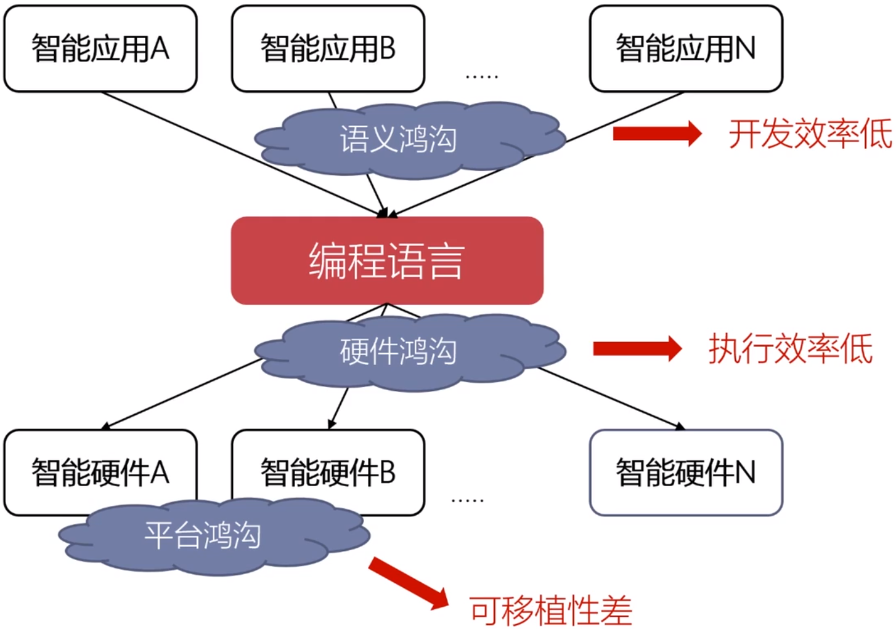
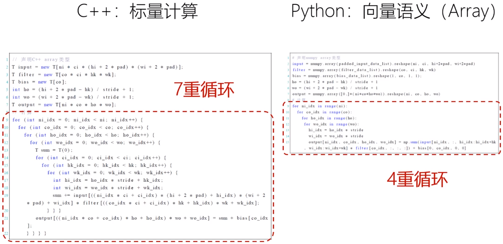
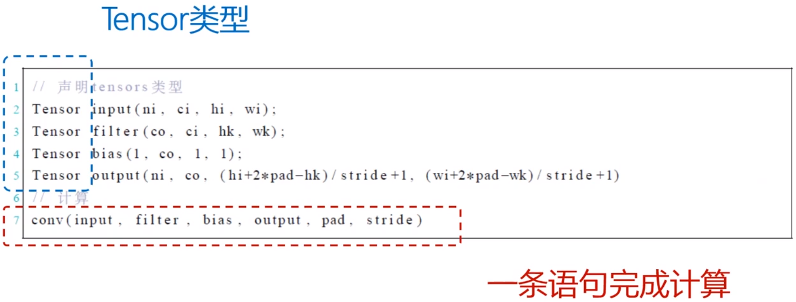
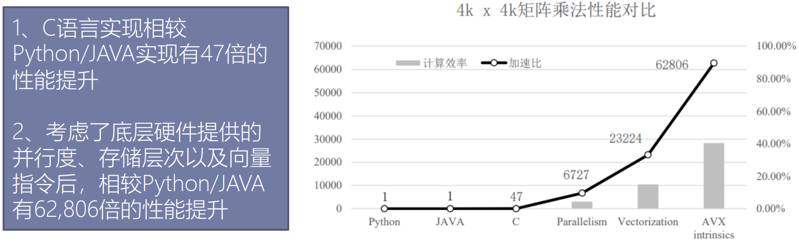
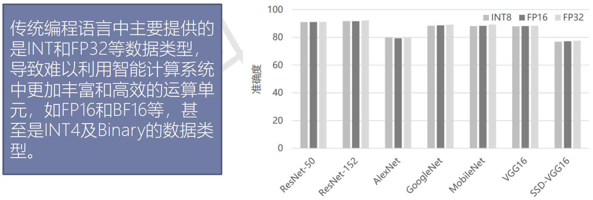
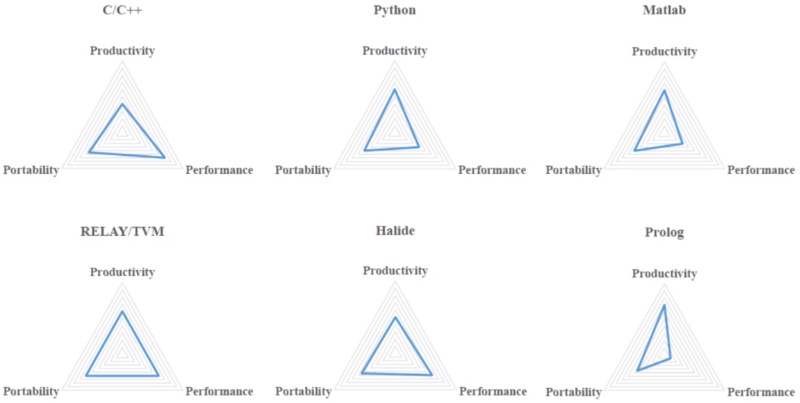

# Chapter 8 智能编程语言
Revision: 1

## 8.1 为什么需要智能编程语言？


### 语义鸿沟
以深度学习中最为核心的卷积运算为例：
- C++：标量计算；
- Python：向量语义(Array)；
- 有Conv语义和Tensor类型的编程语言；




### 硬件鸿沟

- 智能计算硬件在**控制**、**存储**、**计算**等方面有独特性；
- 传统编程语言难以有效描述上述硬件特点；
- 不同层次编程语言和硬件特性带来的性能影响；
- **存储逻辑**上一般采用程序员可见的Scratchpad Memory(SPM)，而不是通用平台上程序员透明的Cache；
- **计算逻辑**上提供了面向智能计算的定制运算单元，如16位浮点、Brain浮点等，其精度损失几乎可忽略；



### 平台鸿沟
- 功能可移植性：采用特定平台专用语言所编写的程序能够在别的平台上正常运行；
	- 矩阵乘法的例子调用了AVX的intrinsic函数，在ARM上无法运行；
- 性能可移植性：在特定平台上优化好的程序，在新的硬件平台上仍然保证有较高的执行效率；
- 理想的编程语言需要**抽取不同硬件平台的共性特征**，并在此基础上提取**性能关键特征作为语言特性**提供给用户；

### 小结
- 面向**语义**、**硬件**、**平台**三大鸿沟，传统编程语言难以满足需求；
- 领域专用编程语言是满足智能计算**高开发效率**、**高性能**和**高可移植性**的重要途径；



## 8.2 智能计算系统抽象架构
### 抽象硬件架构

- 层次化的智能计算系统抽象硬件架构
	- 智能计算系统中每一层都包含存储单元、控制单元和若干计算单元；
	- 每个计算单元进一步分解为子存储单元、控制单元和若干计算单元，整个系统以递归方式构成；
	- 底层的每个叶节点都是具体的加速器，用于完成最基本的计算任务；

#### 典型智能计算系统

- 多卡DLP服务器抽象为五个层次：
	- 服务器级(Server)；
	- 板卡级( Card)；
	- 芯片级(Chip)；
	- 处理器簇级(Cluster)；
	- 处理器核级(Core)；
	- 可以方便地通过增加各层次的规模来提升整个系统算力；

### 控制模型
- 指令是实现对计算和存储进行控制的关键。为了设计高效的指令集，需要充分分析智能领域的典型计算模型，提炼有代表性的操作，进行针对性设计。
- **对智能算法进行抽象**：
	- 控制；
	- 数据传输；
	- 计算：标量、向量、矩阵运算等；
	- 逻辑操作：标量、向量运算等；
- **关注计算与存储的交互**：尽可能将计算与存储并行。例如，将控制计算和访存的指令分开在不同的队列中发射执行，以提高并行度；

### 计算模型
- 程序员可见的护腰包括**定制运算单元**和**并行计算架构**；
- 定制运算单元
	- 智能应用具有一定误差容忍度。通过该特性，一般在智能计算系统中采用定制的低位宽运算单元（FP16、INT8、BF16，甚至INT4等）以提升处理能效；
	- 由于智能应用的多样性和复杂性，目前对于哪种低位宽最为合适无统一结论。例如，推断和训练对于精度的要求不一样，图像/视频类应用和语音类应用对于精度要求也不一样；
- 并行计算架构：任务切分和同步；


### 存储模型
- 智能应用中存在大量数据密集的内存访问，合理地组织存储层次和计算单元同样重要，需要两者协同设计以平衡计算与访存，实现高效的智能计算；
- 分为**全局存储**和**本地存储**；


## 8.3 智能编程模型
### 异构编程模型
- 异构计算系统组成
	- 通用处理器：控制设备（主机端），负责控制和调度等工作；
	- 领域处理器：从设备（设备端），负责大规模的并行计算或领域专用计算任务；
	- 二者协同完成完整计算任务；
- 典型异构计算系统
	- GPU为核心
	- FPGA为核心
	- TPU为核心
	- DLP为核心


#### 分类
从用户接口角度分为两类：
- 构建全新的异构并行编程；
- 对现有编程语言进行异构并行扩展；
- 典型异构并行编程模型对比：

|            |   类别   |   主要编程考量  |
| :--------: | :------: | :---------------------------: |
|   OpenCL   | 语言扩展 | 任务划分+数据分布、通信、同步 |
|    CUDA    | 语言扩展 | 任务划分+数据分布、通信、同步 |
| Copperhead |  新语言  |         任务划分为主          |
|   Merge    |  新语言  |         任务划分为主          |

#### 流程
编译和链接流程
- 整体采用分离式编程方式：主机端和设备端代码；
- 编译器支持是异构并行编程模型的核心；


#### 运行时支持
- 完成任务映射和调度，即指定任务具体在**哪个设备或计算单元**上以**何种顺序**执行；
- 分为主机端和设备端
	- 主机端：**控制部分**和**串行任务**在主机端运行；
	- 设备端：**计算部分**和**并行任务**在设备端运行；

#### 通用智能编程模型
通用智能编程模型以前述异构编程模型为基础

- Kernel定义：定义在设备端DLP上的核心计算任务
- 编译器支持：指定DLP上的核心计算任务如何高效地翻译成目标代码
	- 任务划分：、；
	- 数据通信：为DLP的复杂存储层次提供支持；
	- 同步支持：为并行计算架构提供支持；
- 运行时支持：指定DLP上的核心计算任务以何种方式映射到计算单元
	- 任务调度单位；
	- 队列；

##### Kernel定义
- 与异构编程模型中的概念一致，DLP上执行的任务叫Kernel，资源允许时DLP可同时执行多个并行Kernel；
	- 每个Kernel有一个入口函数，BLC中用`__dlp_entry__` 指定；
	- Kernel的启动需调用运行时API：`InvokeKernel` 函数；
	- 设备端程序默认的函数类型：Device函数，以`__dlp_device__` 来修饰；

##### 编译器支持
- 任务划分
	- 并行内建变量
		- **硬件**：clusterDim（维度）、clusterId（序号）、coreDim、coreId；
		- **任务**：taskDim[XYZ]、taskId[XYZ]；
		- 表示Kernel启动task的规模，有XYZ三个维度，用户根据需求指定；
	- 任务调度类型
		- 表示Kernel运行调度时所需的硬件核；
		- BLOCK类型：Kernel为单核任务，按单核进行调度；
		- UNIONx类型：Kernel为多核并行任务（其中x可为1/2/4，UNION1对应1个cluster 4个核）；
	
	
	- 数据通信：为DLP的复杂存储层次提供支持
		- 隐式数据管理：GPR标量数据，由编译器隐式插入Load/Store指令；
		- 显式数据管理：
			- DRAM/NRAM/WRAM/SRAM间向量及张量数据；
			- 主机-DLP间DRAM数据；
	
	

	- 同步支持：为并行计算架构提供支持
		- `__sync_all`：**同步任务执行的所有核**，只有所有核到达同步点时才继续往下执行；
		- `__sync_cluster`：**同步一个Cluster内部的所有核**，当一个Cluster内所有核都到达同步点时才继续往下执行。与CUDA相比，GPU同一线程块内的thread可以同步，而线程块间的thread无法同步；
	- 内建运算：为用户编程提供支持，提高开发效率
		- 通用智能变成语言提供并实现了`__conv` 与`__mlp` 等内建函数接口，分别对应卷积和全连接等典型神经网络运算；
		- 上述接口是对C/C++的拓展，深度学习处理器端Kernel程序编写时可调用这些接口，通过编译器将这些接口翻译为底层硬件指令；
		- 通用智能编程模型直接实现了神经网络计算的内建接口，能更好地支持智能应用；

##### 运行时支持
- 任务调度单位(BLOCK/UNIONx)
	- 以调度单位将Kernel中的任务在时间或空间维度展开
		- BLOCK：单核调度，当有一个核空闲时，调度一个任务执行；
		- UNIONx：调度时需要x个cluster，当有x个cluster空闲时，调度任务执行
	- 调度单位需要用户在编程时指定。运行时只有当空闲的硬件资源数大于调度单位时，Kernel才会被调用；
- 队列(Queue)
	- 管理需要执行的任务，队列既可以单独工作，也可以协同工作；
	- 运行时（或硬件）不断把任务放到队列中，一旦硬件计算资源有空闲，就从队列中取出一个任务执行；
- 示例


### 智能编程模型实例：BANG异构编程
BANG语言是针对MLU硬件提出的编程语言，兼顾云边端等不同目标平台，提供高性能机器学习计算支持；
- 提供通用的异构编程模型，方便用户拓展自己的应用程序；
- 提供高效的编程接口，发挥底层硬件特性；
- 基于C/C++语言的拓展，简单易用；


#### 流程
- 采用分离式编程，即主机端与设备端程序分开编程并分别编译，最后链接成一个可执行程序；
- 主机端为C/C++程序，通常需调用**CNRT运行时接口**完成以下步骤：
	1. 准备输入数据；
	2. 拷贝输入数据到MLU；
	3. 准备Kernel参数；
	4. 创建Queue；
	5. 指定Kernel任务规模以及调度类型；
	6. 启动Kernel；
	7. MLU到主机的输出数据拷贝；
	8. 资源的释放；


- 设备端使用BANG语言特定的语法规则和接口进行编程；

- 编译和链接也采用分离的方式；
	- MLU端程序采用编译器CNCC进行编译，得到MLU程序的目标文件；
	- Host端程序采用普通C/C++编译器GCC/CLANG等进行编译，得到Host程序的目标文件；
	- 最后使用Host端链接器将MLU与Host程序的目标文件以及CNRT库链接成Host端的可执行文件；


#### 示例：主机端


#### 示例：设备端


## 8.4 智能编程语言基础
### 语法概述
- 智能编程语言考虑基于过程式语言
	- 当前大多数语言是过程式的，可以减少用户学习成本；
	- 当前主流智能算法可以描述为明确过程，适合采用过程式语言描述；
- 参考经典的过程是语言C/C++，我们所定义的智能编程语言同样具有**数据和函数**两个基本要素
	- 例如，定义`add_func` 函数的函数体和C语言一致：
``` c
int add_func(int a, int b) {
	int c = a + b;
	return c;
}
```

#### 基本数据类型
| 基本数据类型 | 长度 | 说明 |
| :--------: | :---------: | :---------: |
| int8_t | 1 byte | 1字节整数 |
| uint8_t | 1 byte | 1字节无符号整数 |
| int16_t | 2 bytes | 2字节整数 |
| uint16_t | 2 bytes | 2字节无符号整数 |
| int32_t | 4 bytes | 4字节整数 |
| uint32_t | 4 bytes | 4字节无符号整数 |
| half | 2 bytes | 半精度浮点数据类型，采用IEEE-754 fp16格式 |
| float | 4 bytes | IEEE-754 fp32格式浮点类型，仅支持类型转换计算 |
| char | 1 bytes | 对应C语言char类型 |
| bool | 1 bytes | 对应C语言bool类型 |
| 指针 | 8 bytes | 指针类型 |

#### 宏、常量与内置变量
- 宏、常量由用户定义，内置变量是语言既有的
	- 宏和常量，宏不仅可以定义常量数据，也可以定义一段代码；常量是不可修改的数据，只能在初始化时被赋值；
	- 内置变量，编程语言本身包含的常量和变量，不需用户定义即可直接使用；

| 内置变量名 |         具体含义         |
| :--------: | :----------------------: |
|   coreId   |      DLP中核的编号       |
| clusterId  |      DLP中簇的编号       |
|   taskId   | 程序运行时分配的任务编号 |

#### I/O操作语句
- 不同层次的智能处理节点有各自的本地存储，需要提供不同存储层次间的数据搬移；
	- 典型的NUMA(Non-Uniform Memory ACCESS Architecture)架构：
	
	
	- 不同处理器核对不同位置存储器的访问速度不同。对于核0而言，其访问设备内存DDR0的速度比访问DDR1的速度更快。DDR0看作是本地存储，DDR1作为全局存储；
	- 片上存储，除了单核内NRAM和权值WRAM，还有一类共享存储，可用于簇内的多核共享；
- 针对上述典型架构（三种片上存储，两种设备内存），可以有多种不同的数据搬移操作类型：


- 针对上述搬移操作类型，可在智能编程语言中定义相应的内建函数`__memcpy`，方便用户实现不同类型的数据搬移：
```c
void __memcpy(void* dst, void* src, uint32 bytes, Direction_t dir);
```

#### 标量计算语句
- 标量即单个数据的计算，标量计算是编程语言的基本功能
	- 智能编程语言的标量计算语句有两种形式：
		- **运算符号**（如+、-、\*、/等）；
		- **内建函数**（如abs、max、min等）；
- 智能编程语言的标量计算由编译器映射到标量计算单元，吞吐量不及张量运算，但具有良好的通用性和灵活性；

#### 张量计算语句
- 张量计算是智能编程语言的主要特点，可以通过内建函数直接映射到张量计算单元；
- 张量计算直接对精度类型和语义类型等数据直接进行操作；

| 张量计算语句 |         具体功能         |
| :--------: | :----------------------: |
| `__vec_add(float* out, float* in1, float* in2, int size)` | 向量对位加 |
| `__vec_sub(float* out, float* in1, float* in2, int size)` | 向量对位减 |
| `__vec_mul(float* out, float* in1, float* in2, int size)` | 向量对位乘 |
| `__conv(half* out, int8* in, int8* weight, half bias, int ci, int hi, int wi, int co, int kh, int kw, int sh, int sw)`| 卷积运算 |
| `__mlp(half* out, int8* in, int8* weight, half bias, int ci, int co)` | 全连接运算 |
| `__maxpool(half* out, half* in, int ci, int hi, int wi, int kh, int kw, int sh, int sw)` | 最大池化运算 |

##### 实例：BANG数学库
- BANG语言将MLU的数学类和神经网络类指令封装成库函数；
- BANG数学库函数是在MLU架构上进行高性能编程的关键；
- BANG数学库头文件：`/usr/local/neuware/lib/clang/x.x.x/include/__clang_bang_math.h`
- **使用约束**：张量计算通常是对批量数据进行操作；
	- 源和目的都是NRAM上的数据；
	- 数据的长度（字节数）必须是128的整数倍；
	- 源和目的地址必须按64位对齐；

- `__bang_add(half* dst, half* src0, half* src1, int32_t NumOfEle)`
	- 语义：两个向量相加，得到新的向量；
	- 约束：源和目标都是`half` 类型；
- `__bang_mul_const(half* dst, half* src0, half* scale, int32_t NumOfEle)`
	- 语义：对向量的每一个元素乘以一个常数；
- `__bang_eq(half* dst, half* src0, half* src1, int32_t NumOfEle)`
	- 语义：对`src0` 和`src1` 两个张量进行element-wise的比较操作，并将结果存入`dst`中；
- `__bang_select(half* dst, half* src0, half* src1, int32_t NumOfEle)`；
- `__bang_max(half* dst, half* src, int32_t NumOfEle)`；
- `__bang_count(half* dst, half* src, int32_t NumOfEle)`；
- ……

#### 控制流语句
- 与通用编程语言一样，智能编程语言同样需要有分支和循环等控制流语句：
	- **分支语句**：用于处理程序的选择逻辑，由判断条件与分支代码段组成，与传统编程语言类似；
	- **循环语句**：用于处理程序循环逻辑，由循环执行条件和循环代码段组成，与传统编程语言类似；
	- **同步语句**：解决多核间并行数据依赖问题，保证最终计算结果正确。主要分为两类：
		- Cluster内同步(`__sync_cluster`)，保证一个Cluster内所有核同步；
		- 全局同步(`__sync_all`)，芯片内所有Cluster、所有核均同步；

#### 串行程序示例
向量中每个数求平方，每次处理64个数


#### 并行程序示例
矩阵乘法示例，在4个核上并行执行，每个核上代码一致 
- 计算1\*32和32\*32的矩阵乘法，最终得到4\*32的结果；
- 通过运行时API来指定任务规模(4\*1\*1)及调度方式(UNION1)；


## 8.5 智能应用编程接口
### Kernel函数接口
- 为了充分利用并行资源，需要在Kernel内部对任务进行有效切分，同时在主机端配置和调用相应的Kernel函数接口；
- 任务切分的内置变量


- 主机端Kernel函数接口
	- 用于将智能编程语言编写的程序加载到DLP上执行；主要关注Kernel参数设置和调用；
	- `GetKernelParamsBuffer(KernelParamsBuffer_t *params)`：获取Kernel的参数块结构，成功返回`RET_SUCCESS`，否则返回相应错误码；
	- `CopyKernelParamsBuffer(KernelParamsBuffer_t dstbuf, KernelParamsBuffer_t srcbuf)`：拷贝`srcbuf` 至`dstbuf`，成功返回`RET_SUCCESS`，否则返回相应错误码；
	- `KernelParamsBufferAddParam(KernelParamsBuffer_t *params, void* data, size_t bytes)`：向`KernelParamsBuffer_t` 中增加常量参数，成功返回`RET_SUCCESS`，否则返回相应错误码；
	- ……

### 运行时接口
- 包括**设备管理**、**队列管理**和**内存管理**等接口；
- 设备管理：主要涉及初始化、设备设置、设备销毁等操作：
	- `Init(unsigned int flags)`
	- `GetDeviceCount(unsigned int* dev_num)`
	- `GetDeviceHandle(Dev_t* pdev, int ordinal)`
	- `SetCurrentDevice(Dev_t dev)`
	- `Destroy(void)`
- 队列管理：队列是用于执行任务的环境。计算任务可下发到队列中执行。同一队列可容纳多个任务。队列有如下属性：
	- **串行性**：下发到同一队列中的任务，按下发顺序串行执行；
	- **异步性**：任务下发到队列是异步过程，即下发完成后程序控制流回到主机，主机程序继续往下执行。运行时环境提供队列的同步接口`SyncQueue` 用于等待队列中所有任务完成；
	- **并行性**：不同队列中的任务并行执行；
- 内存管理：
	- 主机端内存管理：`hostMalloc(void** ptr, size_t bytes, ...)`、`hostFree(void* ptr)`；
	- 设备端内存管理：`devMalloc(void** ptr, size_t bytes)`、`devFree(void* ptr)`；
	- 主机与设备端内存拷贝：`Memcpy(void* dst, void* src, size_t bytes, MemTransDir_t dir)`；

## 8.8 基于智能编程语言的系统开发
### 高性能库算子开发

- 高性能库提供了常见算子在特定平台上的高性能实现，方便用户以API的形式直接调用；
- 如何用智能编程语言拓展高性能库算子？
  - Kernel代码逻辑开发与优化；
  - 高性能库算子接口API的使用；

#### 自定义算子集成

- 算子集成API介绍：典型高性能库中自定义算子集成的主要API，主要包括自定义算子的创建，（前向）计算和销毁等接口；
-  作为自定义的单个基础算子集成进高性能库中执行；

#### 融合算子集成

作为自定义算子和高性能库中已有算子进行**融合计算**

- 减少中间数据片外交换，提高性能；
- 主要使用方式；

 #### TF集成自定义算子

通过高性能库自定义算子API，可以将用编程语言开发的心酸自集成到TF等编程框架中；在框架中的主要流程包括：

1. 为新的自定义算子进行注册；
2. 为新的自定义算子编写前向传播接口函数；
3. 根据新的自定义算子接口编写定制算子底层实现；
4. 完善Bazel Build和头文件，并重新编译TF源码；
