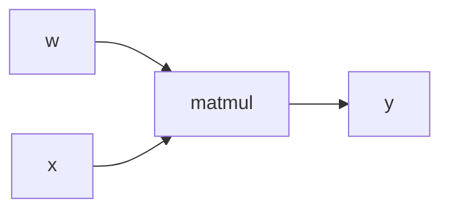
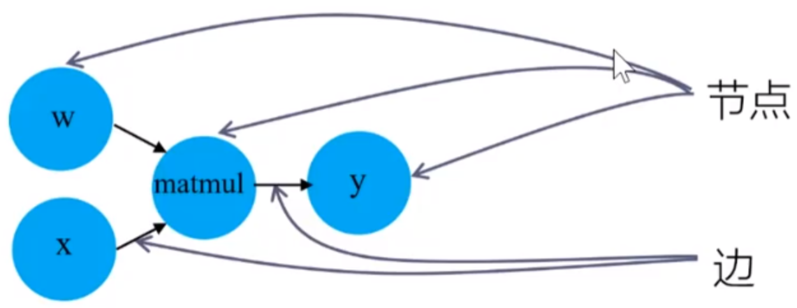
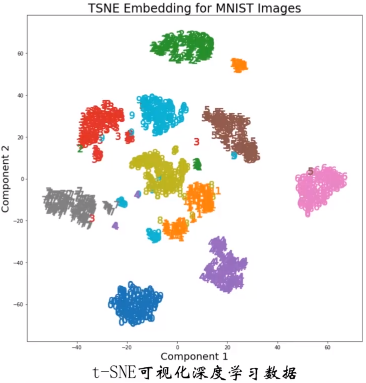
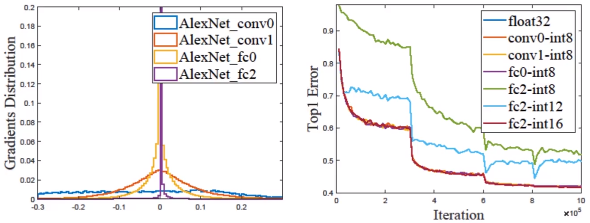
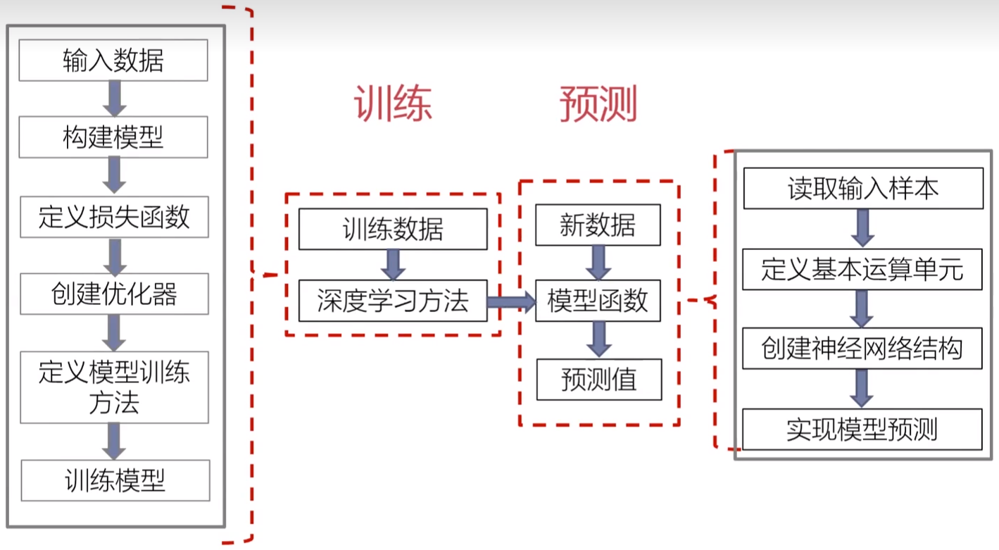
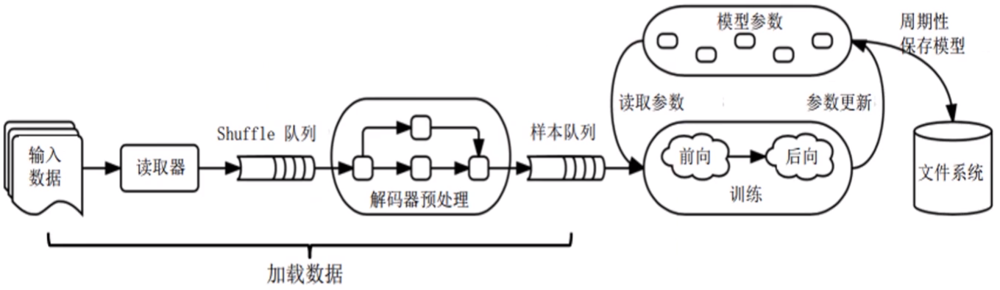

# Chapter 4 深度学习编程框架
## 4.1 概念
### 为什么需要编程框架？
1. 算法理论复杂；
2. 代码实现工作量大；
3. 结果的模糊性，写错代码但是难以从实验数据分析出；
4. 有必要将算法中的常用操作**封装成组件**提供给程序员，以提高深度学习算法开发效率；
	1. 深度学习算法具有**多层结构**，每层的运算由一些基本操作构成；
	2. 这些基本操作存在大量**共性运算**，如卷积、池化、激活等；封装以提升编程实现效率；
	3. 硬件程序员可**基于硬件特征**，有针对性地充分优化操作，以充分发挥硬件的效率；

深度学习编程框架定义：将深度学习算法中的基本操作封装成**一系列组件**，这一系列深度学习组件，即构成一套深度学习框架。

### TensorFlow
- 谷歌团队于2015年开发并开源；
- TF极其变种可以工作与各种类型的异构系统，包括手机、平板等移动设备，数百台机器和数千种计算设备的大规模分布系统；

## 4.2 TensorFlow编程模型及其基本用法
### 命令式编程与声明式编程
- 命令式编程：关注程序执行的具体步骤，计算机按照代码中的顺序一步步执行具体的运算。整体优化困难。
	- 示例：交互式UI程序、操作系统
- 声明式编程：告诉计算机想要达到的目标，不指定具体的实现步骤，而是通过**函数**、**推论规则**等描述数据之间的关系，优化较容易。
	- 示例：人工智能、深度学习

#### TF的几个基本概念
1. 使用**计算图**表示机器学习算法中所有计算和状态；
2. 将所有数据建模成**张量**(tensor)；
3. 具体计算操作运行在**会话**(session)环境；
4. 将多种类型的计算定义为**操作**(operation)；
5. 通过**变量**(viriable)存储计算图中的有状态参数；
6. 通过**占位符**(placeholder)将张量传递到会话中；
7. 通过**队列**(queue)处理数据读取和计算图的异步执行；

### 计算图
- TF使用有向图来描述计算过程。有向图中包含一组**节点**和**边**；
- 支持通过多种高级语言来构建计算图(C++/Python)；
- 计算图对应了神经网络的结构：


#### 节点和边
- **节点**一般用来表示各类操作，包括数学运算、变量读写、数据填充等。也可以表述输入数据、模型参数、输出数据；
- **边**表示“节点”之间的输入输出关系。分为两类：
	- 一类是**传递具体数据**的边。传递的数据即为张量；
	- 一类是**表示节点之间控制依赖关系**的边。这类边不传递数据，只表示节点执行的顺序：必须前序节点计算完成，后序节点才开始计算；


- TensorFlow 1.x：静态图，方便对整个计算图做全局优化，性能高，但调试困难，影响开发效率；
- TensorFlow 2.x：动态图，调试简单，更合适快速开发；但运行效率低于静态图方法；

### 操作
- 计算图中的每个节点即代表一个**操作**，其接收0个或多个tensor作为输入，产生0个或多个tensor作为输出；
- 操作对应了神经网络中的具体计算；
- 示例包含了三个操作：
	1. 给$a$赋常数值
	2. 给$b$赋常数值
	3. $a$、$b$相乘得到$y$

``` python
import tensorflow as tf

a = tf.constant([[3., 3.]])
b = tf.constant([2.], [2.]])

y = tf.matmul(a, b)

with tf.Session() as sess:
	result = sess.run(y)
	print(result)
```

#### 操作的主要属性
|           属性名            |        功能说明        |
|:---------------------------:|:----------------------:|
|      tf.operation.name      |       操作的名称       |
|      tf.operation.type      |       操作的类型       |
|     tf.operation.inputs     |       操作的输入       |
|    tf.operation.outputs     |       操作的输出       |
| tf.operation.control_inputs |  该操作的控制依赖列表  |
|     tf.operation.device     | 执行该操作所使用的设备 |
|     tf.operation.graph     |   操作所属的计算图   |
|    tf.operation.traceback       |   实例化该操作时的调用栈  |

#### 常用操作
|           操作类型            |        常用算子        |
|:---------------------------:|:----------------------:|
|      标量运算      |       add、substract、multiply、div   |
|      矩阵运算      |       matmul、matrix_inverse、matrix_transpose   |
|     逻辑操作     |       logic_and、is_finite    |
|    神经网络运算     |       convolution、max_pool、bias_add   |
| 储存、恢复 |  save、store  |
|     初始化操作    | zeros_initializer |
|     随机运算     |   random_gamma、multinomial   |

### 张量(Tensor)
- TF中，张量是计算图上的数据载体，用张量统一表示所有的数据，张量在计算图的节点之间传递；
- 张量中并没有实际保存数据，而仅是对计算结果的引用，对应了神经网络中各个节点之间流动的数据；
- 张量可看作是$n$维的数组，数组的为数即位张量的**阶数**；
| 阶数 | 对应数据形式 |
|:----:|:------------:|
|  0   |     标量     |
|  1   |     向量     |
|  2   |     矩阵     |
|  n   |   $n$维数组    |

#### 常用属性
| 属性名 |            含义            |
|:------:|:--------------------------:|
| dtype  |    tensor存储的数据类型    |
| shape  |      tensor各阶的长度      |
|  name  |   tensor在计算图中的名称   |
|   op   |    计算出此tensor的操作    |
| device | 计算出此tensor所用的设备名 |
| graph  |  包含此tensor的计算图     |

#### 支持的dtype类型
- int8/int16/int32/int64
- float16/float32/float64
- **bfloat16**：裁短浮点数；
- uint8/uint15/uint32/uint64
- bool
- string
- complex64/complex128：单精度/双精度复数；
- qint8/qint16/qint32：量化的8位/16位/32位有符号整数；
- quint8/quint16：量化的8位/16位无符号整数；

#### 深度学习为什么不需要全部float32
1. 深度学习算法特性：
	- 不同类别的数据间距其实较大；
	- “大间距”意味着容忍非精确计算；


2. 不同数据的位宽需求是不同的：
	- 每层数据都有其**保持网络收敛**的最低位宽需求；
	- 每层数据的**位宽需求**与**数据分布**之间存在关系；



### 会话(Session)
- TF中的计算图描述了计算执行的过程，但并没有真正给输入赋值并执行计算；
- 真正的神经网络计算过程需要在TF程序的 `session` 部分中定义并执行；
- `session` 为程序提供求解张量、执行操作的运行环境。将计算图转化为不同设备上的执行步骤；
- `session` 的典型使用流程：
``` python
# 创建会话
sess = tf.Session()

# 执行会话
sess.run()

# 显式关闭会话
sess.close()

# with语句隐式关闭回会话
with tf.Session() as sess:
	result = sess.run()
	print(result)
```

#### 关闭会话
会话的执行会占用大量硬件资源，因此会话结束时需要关闭会话，以释放资源。

### 变量(Variable)
- 大多数计算中计算图被执行多次，每次执行后其中的值即被释放；
- 变量是计算图中的一种**有状态节点**，用于在多次执行同一计算图时存储并更新指定参数，对应机器学习或深度学习算法中的模型参数；
- 作为有状态节点，其输出由输入、节点操作、**节点内部已保存的状态值**共同作用；

#### 创建变量
将一个tensor传递给`Variable()` 构造函数，创建时需指定变量的形状与数据类型：
1. 使用`tf.Variable()` 函数直接定义
```python
a = tf.Variable(2, tf.int16)	
b = tf.Variable([1, 2])
```
2. 使用TF内置的函数来定义变量初值，可以是常量或随机值
```python
# 以标准差0.35的正态分布初始化一个形状为[20, 40]的变量
r = tf.Variable(tf.random_normal([20, 40], stdev=0.35) 
```

#### 初始化变量
- 创建变量后还需要进行初始化；
- 最简单的变量初始化方法：使用`tf.global_variables_initializer()` 对所有变量初始化；

#### 更新变量
变量更新可以通过优化器自动更新完成，也可通过自定义方法强制赋值更新：
|        更新函数        |             说明             |
|:----------------------:|:----------------------------:|
|      tf.assign()       |         强制赋值更新         |
|    tf.assign_add()     |           加法赋值           |
|    tf.assign_sub()     |           减法赋值           |
|           /           |           自动更新方法           |
| tf.train.\*\*Optimizer | 使用多种优化方法自动更新参数 |

### 占位符(Placeholder)
- 训练神经网络模型时需要大量的样本输入，如果每个输入都用常量表示，则每个常量都需要在计算图中增加一个节点，最终计算图会非常大；
- 计算图表达的是**计算的拓扑结构**，在向计算图填充数据前，计算图并没有真正执行运算；
- TF使用占位符来构建计算图中的样本输入节点，而不需要实际分配数据；
- 占位符本身没有初始值，只是在程序中分配了内存；
- 使用占位符则只会在计算图中增加一个节点，并只在执行时向其填充数据；

### 队列(Queue)
- TF提供了队列机制，通过多线程将读取数据与计算数据分开；
- 队列是一种有状态的操作机制，用以处理数据读取；
- 为了加快训练速度，可采用多个线程读取数据，一个线程消耗数据；
- 队列操作包含入队、出队操作；
- TF提供多种队列机制，如FIFOQueue、RandomShuffleQueue：
	- FIFOQueue
		- 先入先出队列；
		- 当队列满时入队操作会被阻塞，队列为空时出队操作会被阻塞；

## 4.3 基于TensorFlow的训练及预测实现


### 利用TensorFlow实现简单的模型预测
1. 读取输入样本
``` python
import cv2
import numpy as np

def load_image(path):
	img = cv2.imread(path, cv2.IMREAD_COLOR)
	resize_img = cv2.resize(img, (224, 224))
	norm_img = resize_img / 255.0
	return np.reshape(norm_img, (1, 224, 224, 3))
```
2. 定义基本运算单元，使用`tf.nn`模块定义基本运算单元：
``` python
def basic_calc(caltype, nin, inwb=None):
	if caltype == "conv":
		# nin： 本层输入

```
3. 创建神经网络结构
4. 计算模型输出
``` python
# 模型文件路径
vgg19_npy_path = "./vgG_models.npy"
# 输入的内容图像
img_content = load_image("./content.jpg")

with tf.Session() as sess:
	sess.run(tf.global_variables_initializer())
	models = build_vggnet(vgg19_npy_path)
	sess.run(models["input"].assign(img_content))
	res = sess.run(models["pool5"])
	# other precess on res
	...
```

### 利用TensorFlow实现简单的模型训练

1. 构建模型
2. 加载数据
3. 定义损失函数
4. 创建优化器
5. 定义模型训练方法

#### 基于队列API构建输入流水线
要素：
- 文件名称组成的列表；
- 保存文件名称的FIFO队列；
- 相应文件格式的读取器；
- 解码器；
- 生成的样本队列(ShuffleQueue)；

一个典型的输入结构：使用一个队列作为模型训练的输入，多个线程准备训练样本，一个训练线程执行一个训练操作。
- TF提供了两个类来帮助多线程的实现：
	- Coordinator类：同时停止多个工作线程；
	- QueueRunner类：协调多个工作线程同时将多个张量推入同一个队列中；

利用`tf.data` API来构建输入流水线：
- 包含两个基础类：`Dataset` 和`Iterator`；
- `Dataset` 是一类相同类型元素的序列，每个元素由一个或多个张量组成；
- 创建一个`Dataset` 有两种方法；
	- 通过不同的API来读取不同类型的源数据，返回一个`Dataset`；
	- 在已有`Dataset` 基础上通过变换得到新的`Dataset`，包括`map`、`shuffle` 等；
- 利用`Iterator` 类来读取创建好的`Dataset` 中的数据；
- 常用的`Iterator`：
	- ont-shot iterator：单次迭代器，一次遍历所有元素；
	- initializable iterator：可初始化迭代器；
	- reinitializable iterator：可重新初始化迭代器；
	- feedable iterator：可馈送迭代器，与`feed_dict` 配合使用；

#### 加载数据
- 注入(feeding)：利用`feed_dict`直接传递输入数据；
- 预取(pre_load)：利用`Const` 和`Variable` 直接读取输入数据；
- 基于队列API：基于队列相关的API来构建输入流水线(Pipeline)；
- `tf.data` API：利用`tf.data` API来构建输入流水线；

#### 定义损失函数
自定义损失函数
- 基本函数
|   类别   |         基本函数及功能说明         |
|:--------:|:----------------------------------:|
| 四则运算 | tf.add()、tf.sub()、tf.mul()         |
| 科学计算 | tf.abs()、tf.square()、tf.sin() |
| 比较操作 | tf.greater()     |
| 条件判断 | tf.where()        |
| 降维操作 | tf.reduce_sum()、tf.reduce_mean()  |
- 示例
```python
# 实际值和预测值的差值平方再求平均值
loss = tf.reduce_mean(tf.square(y - y_data))
```

TF内置的4个损失函数：
1. softmax交叉熵：`tf.nn.softmax_cross_entropy_with_logits(labels, logits)`；
2. 加了稀疏的softmax交叉熵：`tf.nn.sparse_softmax_cross_entropy_with_logits(labels, logits)`；
3. sigmoid交叉熵：`tf.nn.sigmoid_cross_entropy_with_logits(labels, logits)`；
4. 带权重的sigmoid交叉熵：`tf.nn.weighted_cross_entropy_with_logits(labels, logits, pos_weight)`；
|  参数  |                含义                |
|:------:|:----------------------------------:|
| logits |         网络最后一层的输出         |
| labels | 标签，分类或分割等问题中的标准答案 |

#### 创建优化器
优化器的功能：实现优化算法，可自动为用户计算模型参数的梯度值。
TF中支持的优化器函数：
- `tf.train.Optimizer`；
- `tf.train.GradientDescentOptimizer`：梯度下降优化器；
	- 返回一个优化器，参数为`learningRate`；
	- 用法：`train = tf.train.GradientDescentOptimizer(leaningRate)；
- `tf.train.MomentumOptimizer`：动量梯度下降优化器；
- `tf.train.AdamOptimizer`：Adam算法优化器；
	- 返回一个使用Adam算法的优化器，参数为`learningRate`；
	- Adam算法：综合了Momentum和RMSProp方法，根据算是函数对每个参数的梯度的一阶矩估计和二阶矩估计动态调整针对于每个参数的学习率；
	- 用法：`train = tf.train.AdamOptimizer(leaningRate)；
- `tf.train.RMSPropOptimizer`；
- ……

#### 定义模型训练方法
常用训练操作：
|      操作 |     功能      |
|:---------:|:-----------------:|
| tf.train.Optimizer.minimize(loss, global_step=None, var_list=None) |                   使用最小化损失函数的方法来训练模型，执行该操作时会内部依次调用下述两操作                    |
|     tf.train.Optimizer.compute_gradients(loss, var_list=None)      | 对var_list中列出的模型参数计算梯度，返回（梯度，模型参数）组成的列表 |
|         tf.train.Optimizer.apply_gradients(grads_and_vars)         |           将计算出的梯度更新到模型参数上，返回更新参数的操作            |
一般采用最小化损失函数(minimize)的方法：
- minimize方法可以直接用于模型训练，简单有效
- 对于需要对梯度进行其他处理的优化器，其设计流程为：
	1. 使用`compute_gradients()` 方法计算出梯度；
	2. **按需求处理梯度**，如裁剪、加权、平均等；
	3. 使用`apply_gradients()` 方法将处理后的梯度值更新到模型参数中；

#### 对梯度的处理
对于模型层次较多的网络，由于输入数据不合法、求导精度限制等原因，可能出现梯度爆炸或消失的问题，使得模型训练无法快速收敛。解决方法：
1. 减小学习率；
2. 梯度裁剪(Gradient Clipping)
	- 示例：对梯度的$L^2$范式进行裁剪：
	梯度的$L^2$范式为：
	$$\parallel t\parallel_2=\sqrt{grad(w_1)^2+grade(w_2)^2+\cdots}$$
	设置裁剪阈值$c$，则当$\parallel t\parallel_2>c$时，
	$$grade(w_i)=\dfrac{c}{\parallel t\parallel_2}\cdot grad(w_i)$$当$\parallel t\parallel_2\le c$时，$grade(w_i)$不变；

TF中内置的梯度处理功能：
|   方法   |         功能         |
|:--------:|:----------------------------------:|
| tf.clip_by_value(t, clip_value_min, clip_value_max) | 将梯度t裁剪到[clip_value_min, clip_value_max]区间     |
| tf.clip_by_norm(t, clip_norm) | 对梯度t的L2范式进行裁剪，clip_norm为裁剪阈值 |
| tf.clip_by_average_norm(t, clip_norm) | 对梯度t的平均L2范式进行裁剪，clip_norm为裁剪阈值    |
| tf.clip_by_global_mnorm(t_list, clip_norm)  | 对梯度t_list进行全局规范化加和裁剪，clip_norm为裁剪阈值       |
| tf.global_norm(t_list) | 计算t_list中所有梯度的全局范式  |

#### 模型保存
在模型训练过程中，使用`tf.train.Saver()`来保存模型中的所有变量。